# TP5 — Laboratorio Físico
### Implementación de Redes — Instituto Técnico Salesiano Villada (2026)
**Grupo 2 — Seguros del Centro S.A.**

<p align="center">
  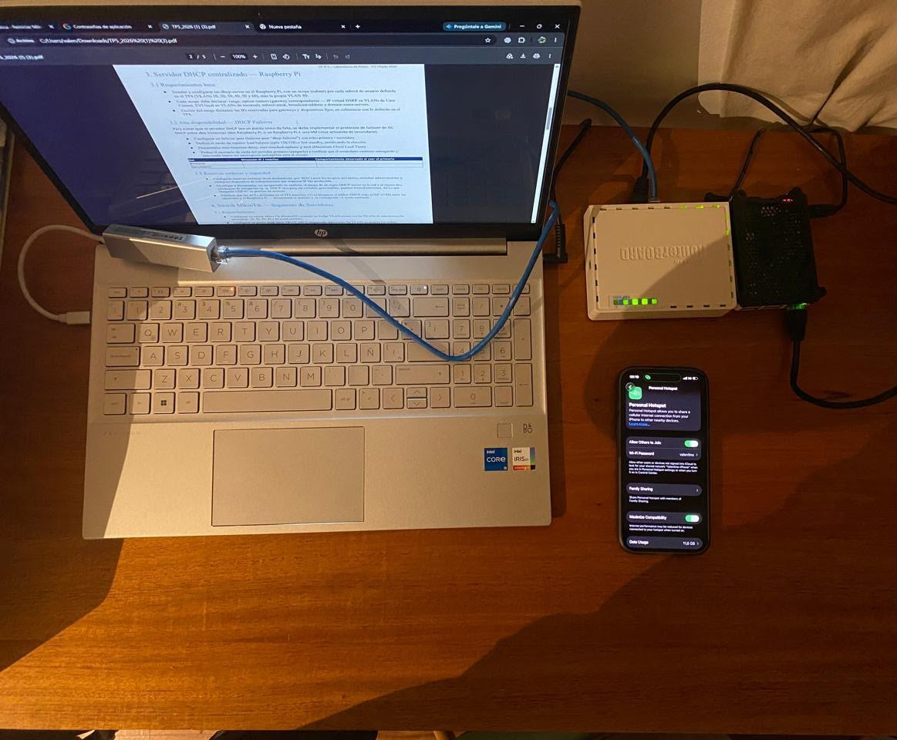
</p>

*Implementación física y validación real de servicios de red del TP5 mediante MikroTik, Raspberry Pi, VM Linux, notebook y conexión celular.*

---

### Código Semántico de Señales Visuales

* 🟢 **Verde:** Funcionamiento validado, servicio en línea, prueba aprobada (`PASS`).
* 🔵 **Azul:** Información técnica de diseño, configuración activa, direccionamiento estándar.
* 🟡 **Amarillo:** Configuración temporal de staging, advertencia de laboratorio, interfaz transitoria.
* 🔴 **Rojo:** Simulación de falla, caída forzada de enlace, pérdida de conectividad, riesgo.
* 🟣 **Violeta:** Requisito diferido para simulación en GNS3, topología futura multi-vendor.

---

### Contenido de la Guía

* **Parte I — Entender el laboratorio**
  1. [¿Qué hicimos en este laboratorio?](#1-qué-hicimos-en-este-laboratorio)
  2. [¿Por qué hicimos un laboratorio físico?](#2-por-qué-hicimos-un-laboratorio-físico)
  3. [Objetivos del laboratorio y alcance](#3-objetivos-del-laboratorio-y-alcance)
  4. [Topología física simplificada y flujo de tráfico](#4-topología-física-simplificada-y-flujo-de-tráfico)
  5. [Topología física detallada](#5-topología-física-detallada)
  6. [Hardware y software utilizado](#6-hardware-y-software-utilizado)
  7. [Direccionamiento IP: laboratorio físico, partición VLSM y scopes DHCP](#7-direccionamiento-ip-laboratorio-físico-partición-vlsm-y-scopes-dhcp)
* **Parte II — Construcción paso a paso**
  8. [Línea temporal de implementación](#8-línea-temporal-de-implementación)
  9. [Preparación y reset del MikroTik](#9-preparación-y-reset-del-mikrotik)
  10. [Segmentación VLAN 80 en switch MikroTik](#10-segmentación-vlan-80-en-switch-mikrotik)
  11. [Raspberry Pi — Servidor DHCP primario](#11-raspberry-pi--servidor-dhcp-primario)
  12. [VM Linux — Servidor DHCP secundario y VMware bridged](#12-vm-linux--servidor-dhcp-secundario-y-vmware-bridged)
  13. [Configuración de DHCP failover Primary/Secondary](#13-configuración-de-dhcp-failover-primarysecondary)
  14. [Reservas DHCP estáticas vs Pool dinámico](#14-reservas-dhcp-estáticas-vs-pool-dinámico)
  15. [Salida a Internet real vía hotspot celular](#15-salida-a-internet-real-vía-hotspot-celular)
  16. [NAT masquerade y simple queue (QoS)](#16-nat-masquerade-y-simple-queue-qos)
  17. [Diagnóstico de NAT / posible CGNAT móvil](#17-diagnóstico-de-nat--posible-cgnat-móvil)
  18. [MikroTik cloud DDNS (Dynamic DNS)](#18-mikrotik-cloud-ddns-dynamic-dns)
  19. [Demostración de port-forwarding (dst-nat)](#19-demostración-de-port-forwarding-dst-nat)
  20. [Monitoreo Netwatch y notificaciones Gmail SMTP TLS](#20-monitoreo-netwatch-y-notificaciones-gmail-smtp-tls)
* **Parte III — Cómo comprobamos que funciona**
  21. [Prueba 1: Concesión DHCP normal y asignación determinística por reserva MAC](#21-prueba-1-concesión-dhcp-normal-y-asignación-determinística-por-reserva-mac)
  22. [Prueba 2: Incorporación de cliente nuevo a VLAN 80 en ether4 (Pool dinámico y salida a Internet)](#22-prueba-2-incorporación-de-cliente-nuevo-a-vlan-80-en-ether4-pool-dinámico-y-salida-a-internet)
  23. [Prueba 3: Demostración de DHCP Failover con cliente dinámico (.227 ➔ .228 ➔ .227)](#23-prueba-3-demostración-de-dhcp-failover-con-cliente-dinámico-227--228--227)
  24. [Prueba 4: Conectividad y salida a Internet real (con Wi-Fi local deshabilitado)](#24-prueba-4-conectividad-y-salida-a-internet-real-con-wi-fi-local-deshabilitado)
  25. [Prueba 5: Resiliencia ante corte WAN y autonomía local](#25-prueba-5-resiliencia-ante-corte-wan-y-autonomía-local)
  26. [Prueba 6: Ensayo de tráfico entrante por DDNS / port-forwarding](#26-prueba-6-ensayo-de-tráfico-entrante-por-ddns--port-forwarding)
  27. [Prueba 7: Monitoreo Netwatch y disparo de alertas Gmail](#27-prueba-7-monitoreo-netwatch-y-disparo-de-alertas-gmail)
  28. [Validación posterior a apagado y nueva puesta en marcha](#28-validación-posterior-a-apagado-y-nueva-puesta-en-marcha)
* **Parte IV — Operación y estudio**
  29. [Acceso y administración de dispositivos](#29-acceso-y-administración-de-dispositivos)
  30. [Chuleta de verificación rápida por equipo](#30-chuleta-de-verificación-rápida-por-equipo)
  31. [Matriz de troubleshooting: problemas reales y soluciones](#31-matriz-de-troubleshooting-problemas-reales-y-soluciones)
  32. [Sistema de backups y procedimientos de rollback](#32-sistema-de-backups-y-procedimientos-de-rollback)
  33. [Registro consolidado de pruebas de validación y telemetría](#33-registro-consolidado-de-pruebas-de-validación-y-telemetría)
* **Parte V — Cierre y próximos pasos**
  34. [Dashboard ejecutivo de conformidad](#34-dashboard-ejecutivo-de-conformidad)
  35. [Estado final del laboratorio físico](#35-estado-final-del-laboratorio-físico)
  36. [Requisitos pendientes para la etapa GNS3](#36-requisitos-pendientes-para-la-etapa-gns3)
  37. [Notas de consistencia técnica y auditoría final](#37-notas-de-consistencia-técnica-y-auditoría-final)

---

# Parte I — Entender el laboratorio

## 1. ¿Qué hicimos en este laboratorio?

Construimos un laboratorio físico a pequeña escala con hardware real para implementar, poner a prueba y validar empíricamente los servicios centrales de red del Trabajo Práctico N°5 antes de desplegarlos en el entorno simulado corporativo.

Para lograrlo, articulamos seis dispositivos y roles asignando a cada uno una función clave de infraestructura:

* **MikroTik hAP ac lite:** Cumple el rol de switch de conmutación en Capa 2 (aislando la VLAN 80 de servidores mediante hardware filtering en `ether2`, `ether3` y `ether4`), gateway definitivo de Capa 3 del laboratorio físico (`172.18.2.225/28`), cliente Wi-Fi hacia el uplink celular (`wlan1`), router de NAT Masquerade, control de ancho de banda (Simple Queue), DDNS oficial y sonda de monitoreo autónomo Netwatch.
* **Raspberry Pi 3B:** Actúa como servidor DHCP centralizado Primario de la empresa (`172.18.2.227/28`), conectado al puerto `ether3`, alojando la configuración de los 10 scopes corporativos, el pool dinámico de VLAN 80 (`.230-.238`) y la sincronización de alta disponibilidad failover.
* **VM Linux (Ubuntu Server 26.04 LTS en VMware):** Servidor DHCP Secundario en esquema de failover Primary/Secondary (`172.18.2.228/28`), enlazada en modo puente físico exclusivo al adaptador Realtek USB en `ether2`, sincronizado por TCP 647.
* **Notebook principal Lenovo (Windows 11):** Funciona como consola de administración técnica (WinBox, SSH, consolas), cliente de red con reserva estática determinística por dirección MAC (`172.18.2.229/28`) y host hipervisor de la VM.
* **Notebook externa de prueba (Windows):** Estación cliente completamente independiente conectada al puerto de acceso `ether4` sin reserva previa, utilizada para auditar la entrega de direcciones del pool dinámico (`172.18.2.236/28`), la conmutación activa de failover y la salida a Internet real con su placa Wi-Fi local deshabilitada.
* **Apple iPhone:** Provee conexión real a Internet mediante su función de Compartir Internet (Hotspot 4G/LTE), simulando el enlace con un proveedor de servicios (ISP).

### ¿Qué logramos validar con éxito?

1. **VLAN 80 real multi-puerto:** Conmutación aislada por hardware con tres puertos de acceso específicos (`ether2`, `ether3` y `ether4` con `PVID=80` y untagged) sin mezcla de tráfico con otras subredes.
2. **DHCP centralizado con 10 scopes:** Entrega dinámica de parámetros TCP/IP hacia los hosts de la empresa según el direccionamiento maestro VLSM.
3. **Incorporación de cliente dinámico nuevo en ether4:** Conexión de una notebook externa sin reserva previa que negoció con éxito la IP `172.18.2.236/28` del pool dinámico (`.230-.238`), con gateway `172.18.2.225` y DNS corporativos.
4. **DHCP Failover en caliente con cliente dinámico:** Demostración empírica de alta disponibilidad mediante el ciclo completo: Primario `.227` activo ➔ detención forzada del servicio ➔ el Secundario `.228` asume inmediatamente las renovaciones con lease de contingencia MCLT (`172.18.2.228` como servidor activo) ➔ restauración del Primario ➔ resincronización automática de bases de datos por TCP 647 (estado `normal / normal`) ➔ retorno transparente de las renovaciones al Primario `.227`.
5. **Diferenciación estricta entre reserva fija y pool dinámico:** Reserva estática determinística por hardware MAC (`.229`) para la estación de administración, manteniendo el pool dinámico (`.230-.238`) para clientes variables como la notebook de prueba (`.236`).
6. **Salida a Internet real y verificación de ruta física:** Navegación web funcional desde todos los equipos (Linux, Raspberry, Windows y RouterOS) a través de radioenlace inalámbrico 4G/LTE, comprobada en el cliente externo con su placa Wi-Fi local desactivada para garantizar que el tráfico cursó 100% por `ether4` ➔ MikroTik ➔ NAT ➔ `wlan1` ➔ iPhone.
7. **NAT dinámico (Masquerade):** Traducción de direcciones IP privadas de la empresa hacia la IP asignada por el proveedor celular.
8. **Control de ancho de banda (QoS):** Aplicación de una cola simple de tráfico (`2 Mbps subida / 4 Mbps bajada`) para preservar el consumo de datos móviles en el segmento de servidores.
9. **MikroTik Cloud DDNS:** Publicación del enrutador mediante un nombre de dominio dinámico oficial (`hgj09y39n1t.sn.mynetname.net`) y diagnóstico empírico de las condiciones de NAT celular.
10. **Monitoreo autónomo (Netwatch) y alertas automáticas por Gmail:** Supervisión continua de conectividad de Capa 3 mediante 4 sondas ICMP y despacho instantáneo de correos electrónicos cifrados por SMTP TLS ante caídas y restablecimientos de nodo.
11. **Persistencia de arranque en frío y revalidación total:** Comprobación de que tras un apagado completo y rearmado físico desde cero, el laboratorio recupera de forma autónoma su conectividad, sincronización de clúster, reglas de firewall y despacho de notificaciones UP por Gmail.

---

## 2. ¿Por qué hicimos un laboratorio físico?

El Trabajo Práctico N°5 contempla una topología completa y compleja de múltiples sucursales y Casa Central, la cual será simulada y completada en **GNS3**.

Sin embargo, emprender este laboratorio con equipamiento físico real obedece a razones pedagógicas y de ingeniería:

* **Demostración de servicios en hardware real:** No contamos físicamente con los 4 switches multicapa Cisco Catalyst ni con los routers Cisco corporativos que demanda la maqueta íntegra. Por lo tanto, decidimos implementar en hardware tangible los servicios de red que sí podíamos poner a prueba de forma fidedigna.
* **Convivencia multi-vendor:** Experimentar en el mundo físico la interacción entre sistemas operativos heterogéneos (RouterOS de MikroTik, Debian GNU/Linux en arquitectura ARM, Ubuntu Server en x86_64 y Windows 11).
* **Resolución de problemas del mundo real:** Diagnosticar fenómenos que no ocurren en un simulador, como tiempos reales de negociación de interfaces, compatibilidad de radios Wi-Fi de 2.4 GHz vs 5 GHz, opciones DHCP de telefonía móvil y pérdida de paquetes físicos.
* **División clara de alcances:** Todo lo referente a redundancia de enrutamiento (HSRP), protocolos de enrutamiento dinámico (OSPF/RIP), switches multicapa Cisco (MLS), enlaces troncales 802.1Q y DHCP Relay multi-sitio queda asignado a la maqueta de **GNS3**.

### Decisiones técnicas y limitaciones del entorno

Durante el diseño del laboratorio se analizaron opciones de interconexión directa entre el hardware físico y el emulador GNS3, descartándose esa variante por las siguientes razones técnicas:

1. **VLAN Tag Stripping en Windows 11:** Al intentar pasar tramas troncales 802.1Q desde el switch físico hacia GNS3 a través del adaptador de red USB Realtek, los controladores del sistema operativo Windows descartan automáticamente las etiquetas de VLAN (*tag stripping*) antes de entregarlas a la máquina virtual, destruyendo la segmentación de red.
2. **Corrupción de tramas BPDU en adaptadores USB:** Los puentes de red de software (`uBridge`) en interfaces de red USB económicas presentan inestabilidad al cursar tramas Spanning Tree (BPDU de RSTP/PVST+), provocando bucles falsos o desconexiones erráticas.
3. **Estabilidad arquitectónica:** Mantener el segmento de servidores validado en hardware físico y modelar el core Cisco y MikroTik CHR en GNS3 garantiza una arquitectura pedagógica sólida, reproducible y libre de anomalías de emulación.

---

## 3. Objetivos del laboratorio y alcance

El objetivo primordial es construir, probar y certificar en equipamiento real el bloque de servidores de Casa Central para Seguros del Centro S.A., asegurando alta disponibilidad de direccionamiento y conectividad hacia el exterior.

<p align="center">
  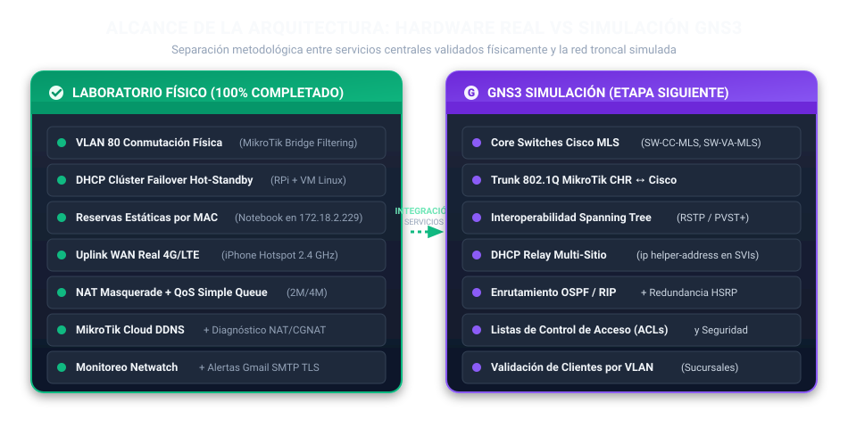
</p>
<p align="center"><em>Figura 1 — Separación pedagógica entre el laboratorio físico completado y la posterior integración troncal en GNS3.</em></p>

---

## 4. Topología física simplificada y flujo de tráfico

Para comprender el laboratorio sin complejidad innecesaria, el esquema básico de interconexión se resume a continuación:

```text
                   INTERNET
                      │
                   iPhone
                  Hotspot 4G
                      │ Wi-Fi
                      ▼
                   MikroTik
                 172.18.2.225
               /      |       \
          ether3    ether2     ether4
             │        │          │
             ▼        ▼          ▼
       Raspberry   Notebook   Notebook Prueba
      DHCP Primary (Host .229) (Cliente Dinámico
      172.18.2.227    │        172.18.2.236)
                      │ VMware
                      ▼
                   VM Linux
                DHCP Secondary
                 172.18.2.228
```

### ¿Cómo circula el tráfico en este laboratorio?

1. **Tráfico hacia Internet:** Cuando cualquier equipo de la red local envía paquetes hacia el exterior, los remite a su gateway temporal en el MikroTik (`172.18.2.225`). El MikroTik realiza NAT Masquerade y cursa los paquetes por su radio Wi-Fi `wlan1` hacia el hotspot del iPhone (`172.20.10.1`), el cual los enruta a través de la red celular 4G/LTE.
2. **Tráfico DHCP normal y reserva estática:** La notebook de administración solicita parámetros TCP/IP emitiendo difusiones en la VLAN 80 a través de `ether2`. El servidor Primario en la Raspberry Pi (`.227`) atiende la petición y le entrega de manera fija la dirección reservada `172.18.2.229` por coincidencia de dirección MAC.
3. **Tráfico de cliente dinámico nuevo en ether4:** Al conectar una notebook externa al puerto `ether4` sin reserva previa, el servidor Primario (`.227`) le adjudica dinámicamente una dirección del pool corporativo de VLAN 80 (`172.18.2.236/28`), con gateway `172.18.2.225` y DNS corporativos. Con la interfaz Wi-Fi de esta notebook deshabilitada, todo su tráfico web fluye íntegramente por `ether4 ➔ VLAN 80 ➔ MikroTik .225 ➔ NAT ➔ wlan1 ➔ iPhone ➔ Internet`.
4. **Tráfico de contingencia y failover:** La máquina virtual Secundaria (`.228`) escucha permanentemente en el mismo segmento conmutado mediante el puerto `ether2`. Si el servicio primario se interrumpe, la VM asume inmediatamente las solicitudes y renovaciones (incluyendo la del cliente dinámico `.236`).
5. **Tráfico de sincronización:** Ambos servidores DHCP dialogan de manera ininterrumpida entre sí intercambiando el estado de las asignaciones mediante el protocolo DHCP Failover sobre el socket TCP 647.

---

## 5. Topología física detallada

Una vez comprendido el flujo elemental, el siguiente diagrama refleja el detalle de interfaces de red, identificadores de Capa 2 (direcciones MAC), direccionamiento IP y protocolos configurados en cada nodo:

<p align="center">
  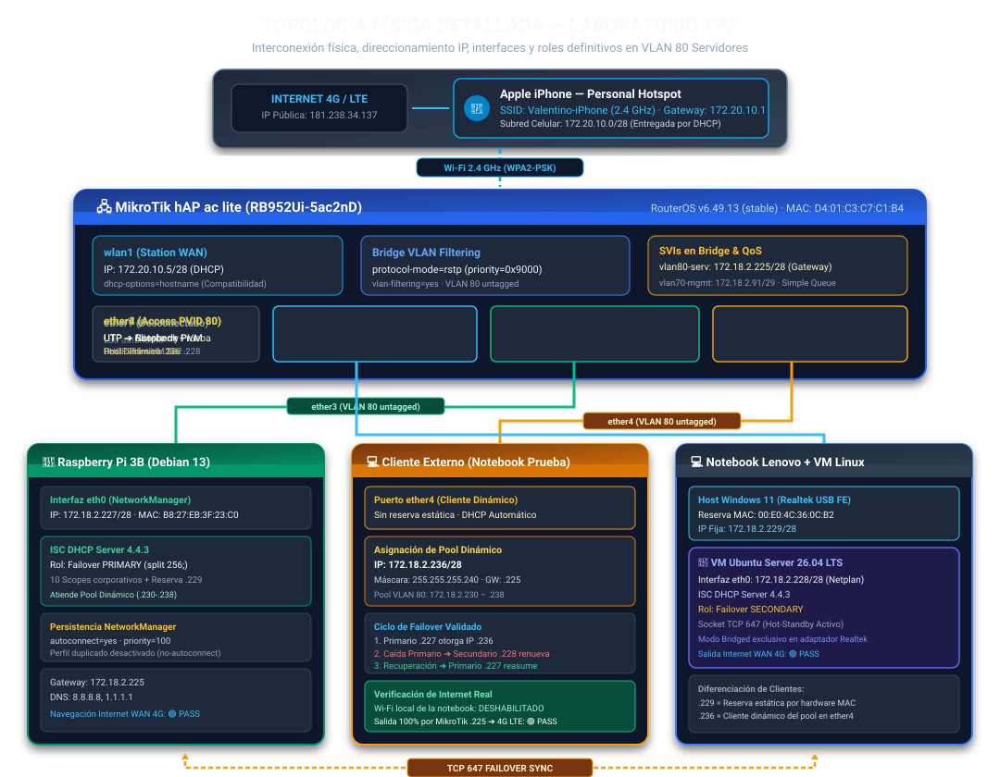
</p>
<p align="center"><em>Figura 2 — Topología física detallada con direccionamiento IP, interfaces y roles definitivos en la VLAN 80.</em></p>

### Guía de cableado y conexiones físicas

* **Puerto `ether1` (MikroTik):** Desconectado. El laboratorio físico queda completamente autónomo e independiente; no se conectará ningún trunk físico hacia Cisco en `ether1`. La integración multi-vendor con Cisco y el trunk 802.1Q se implementarán de forma 100% virtual en GNS3 mediante una máquina virtual MikroTik CHR.
* **Puerto `ether2` (MikroTik):** Conectado con cable UTP directo al adaptador **Realtek USB Ethernet** de la notebook Lenovo. Configurado como puerto de acceso en **VLAN 80** (`PVID=80`). Transporta el tráfico de la notebook de administración (`.229`) y de la VM secundaria (`.228`).
* **Puerto `ether3` (MikroTik):** Conectado con cable UTP directo a la interfaz `eth0` de la **Raspberry Pi 3B**. Opera como puerto de acceso en **VLAN 80** (`PVID=80`), alojando el servidor DHCP Primario (`.227`).
* **Puerto `ether4` (MikroTik):** Configurado permanentemente como **puerto de acceso en VLAN 80 (`PVID=80`)**. Su función de diseño definitiva es: **Puerto de acceso VLAN80 reservado para clientes de prueba y demostraciones de DHCP/failover**. Conectado con cable UTP directo hacia la notebook externa de pruebas para auditar concesiones del pool dinámico sin interferir con la estación de control.
* **Interfaz inalámbrica `wlan1` (MikroTik):** Radio integrada operando en modo cliente (`station`) en la frecuencia de 2.4 GHz, asociada por WPA2-PSK al Hotspot del iPhone.

---

## 6. Hardware y software utilizado

### Inventario de hardware

| Dispositivo | Modelo / Especificaciones | Identificador MAC | Función en el Laboratorio |
| :--- | :--- | :--- | :--- |
| **Router / Switch** | MikroTik hAP ac lite (`RB952Ui-5ac2nD`) | `D4:01:C3:C7:C1:B4` (Bridge)<br>`D4:01:C3:C7:C1:B9` (wlan1) | Switch VLAN 80 (`ether2,3,4`), Gateway Definitivo, Cliente WiFi WAN, NAT y Netwatch. |
| **Servidor Primario** | Raspberry Pi 3 Model B (Debian GNU/Linux 13 trixie aarch64) | `B8:27:EB:3F:23:C0` (`eth0`) | Servidor DHCP Primario (`ether3`), NTP y base de datos de leases. |
| **Estación de Control** | Notebook Lenovo (Windows 11 x64) | `00:E0:4C:36:0C:B2` (Realtek USB) | Consola de administración, WinBox, SSH, cliente DHCP con reserva fija y host VMware (`ether2`). |
| **Adaptador de Red** | Realtek USB Fast Ethernet Family Controller | `00:E0:4C:36:0C:B2` | Conexión cableada física al puerto `ether2` del MikroTik. |
| **Cliente de Prueba** | Notebook Windows (Segunda notebook externa) | Adaptador Ethernet integrado | Cliente DHCP dinámico de pruebas en `ether4` (Pool VLAN 80 `.236`, Wi-Fi off). |
| **Proveedor ISP Real**| Apple iPhone (Personal Hotspot 4G/LTE) | `5E:E6:D2:2A:22:26` (BSSID) | Uplink WAN inalámbrico con direccionamiento dinámico por DHCP. |

<p align="center">
  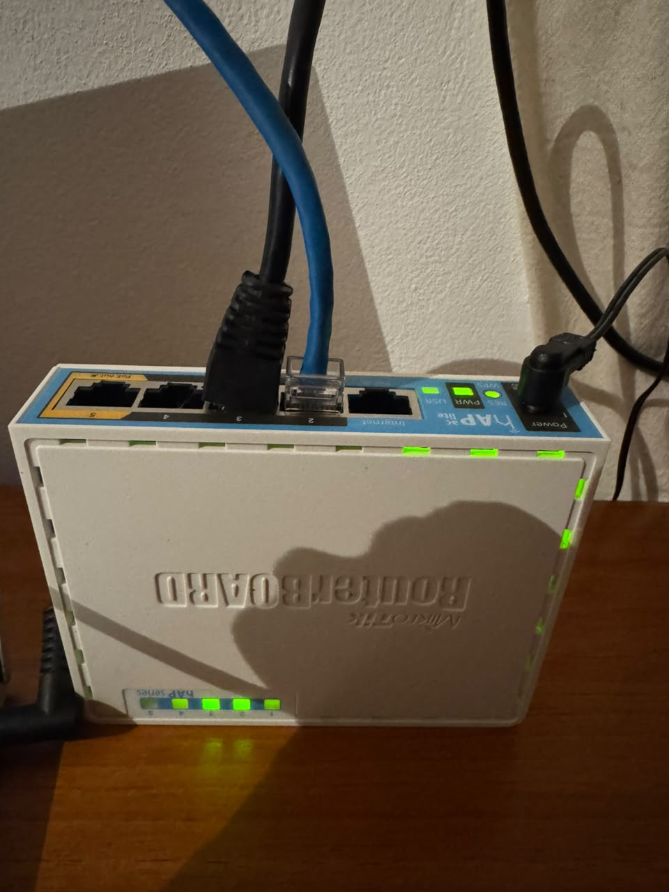
</p>
<p align="center"><em>Figura 3 — Router y switch de servidores MikroTik hAP ac lite: cable azul en ether2 (Notebook/VM), cable negro en ether3 (Raspberry Pi) y cable en ether4 (Cliente de prueba dinámico).</em></p>

### Inventario de software

| Software | Versión Exacta / Distribución | Hostname / Interfaz | Función |
| :--- | :--- | :--- | :--- |
| **MikroTik RouterOS** | `v6.49.13 (stable)` | `MikroTik` / `bridge`, `wlan1` | Sistema operativo del switch de servidores y gateway definitivo. |
| **ISC DHCP Server** | `4.4.3-P1` | `raspberrypi` / `dhcp-secondary` | Motor de DHCP Failover instalado en Raspberry Pi y VM Linux. |
| **VMware Workstation** | `17.x Pro` | Host Windows 11 | Hipervisor anfitrión para el Servidor DHCP Secundario. |
| **Linux Guest VM** | Ubuntu Server 26.04 LTS x86_64 (Kernel 7.0) | `dhcp-secondary` / `eth0` | Instancia virtualizada del Servidor DHCP Secundario. |
| **WinBox** | `v3.40 / v4.0` | Cliente Windows 11 | Herramienta gráfica de administración RouterOS por Capa 2 (MAC) y Capa 3 (IP). |
| **OpenSSH / PowerShell**| `OpenSSH 9.x` / `PowerShell 5.1 & 7.x` | Cliente Windows 11 | Consolas de gestión remota, pruebas y scripting. |

---

## 7. Direccionamiento IP: laboratorio físico, partición VLSM y scopes DHCP

### 7.1. Tabla operativa del laboratorio físico

Resumen de las direcciones IP activas durante la ejecución de las pruebas físicas:

| Dispositivo / Interfaz | Dirección IP | Máscara / CIDR | Rol en el Laboratorio Físico | Rol en Maqueta Virtual GNS3 |
| :--- | :--- | :--- | :--- | :--- |
| **MikroTik (`vlan80-serv`)** | `172.18.2.225` | `255.255.255.240` (/28) | Gateway Definitivo VLAN 80 (Lab Físico) | Independiente; Cisco virtual tendrá su propia SVI en GNS3 |
| **MikroTik (`vlan70-mgmt`)** | `172.18.2.91` | `255.255.255.248` (/29) | IP Definitiva de Gestión MikroTik | Switch Servidores (VLAN 70 Casa Central) |
| **Raspberry Pi (`eth0`)** | `172.18.2.227` | `255.255.255.240` (/28) | Servidor DHCP Primario en `ether3` (Estática) | Servidor DHCP Primario corporativo |
| **VM Linux (`eth0`)** | `172.18.2.228` | `255.255.255.240` (/28) | Servidor DHCP Secundario en `ether2` (Estática) | Servidor DHCP Secundario corporativo |
| **Notebook Lenovo (Ethernet)**| `172.18.2.229` | `255.255.255.240` (/28) | Cliente con reserva estática por MAC (`ether2`) | Host de administración / Servidor |
| **Notebook Prueba (Ethernet)**| `172.18.2.236` | `255.255.255.240` (/28) | Cliente dinámico real del pool en `ether4` | Host cliente dinámico de validación |
| **Pool dinámico VLAN 80** | `.230 – .238` | `255.255.255.240` (/28) | Rango de concesión dinámica (9 IPs utilizables) | Pool dinámico para servidores/hosts adicionales |
| **MikroTik (`wlan1`)** | `172.20.10.5` | `255.255.255.240` (/28) | Cliente WAN inalámbrico (Hotspot) | Enlace temporal de salida a Internet |
| **Apple iPhone (Hotspot)** | `172.20.10.1` | `255.255.255.240` (/28) | Gateway WAN Celular hacia Internet 4G | Proveedor ISP simulado |

### 7.2. Roles de .225 y .226 en VLAN 80: Laboratorio Físico Autónomo vs Simulación GNS3

Para evitar ambigüedades arquitectónicas, se formaliza la relación entre ambos entornos:

* **En el Laboratorio Físico (Hardware Real):** El router MikroTik hAP ac lite tiene asignada la dirección **`172.18.2.225/28`** en su SVI `vlan80-serv`, actuando como el **Default Gateway permanente del laboratorio físico**. Esta dirección **NO se retira del MikroTik físico**, asegurando la total autonomía y operatividad continua del banco de pruebas real con su clúster DHCP, salida a Internet y sondas de monitoreo.
* **En la Maqueta Virtual GNS3:** La topología corporativa completa (switches multicapa Cisco, routers Cisco, enlaces troncales, HSRP y OSPF) se implementará en un entorno de simulación 100% virtual. La integración multi-vendor con MikroTik en GNS3 se realizará mediante una máquina virtual independiente **MikroTik CHR (Cloud Hosted Router)**. De este modo, **no se requiere hardware Cisco físico**, no se conecta ningún trunk en `ether1` del hAP ac lite real, ni se altera la configuración del equipo físico. En GNS3, el switch multicapa virtual Cisco `SW-CC-MLS` poseerá su propia SVI de VLAN 80 configurada con la IP `.225` dentro de su entorno emulado aislado.
* **Rol de `172.18.2.226`:** Corresponde a la subinterfaz `Gi0/0.80` del Router Core Cisco **`R-CC`** (modelado en GNS3).

> ### 🏷️ Desglose del Bloque VLAN 80 Servidores (`172.18.2.224/28`) — Máscara `255.255.255.240`
>
> | Dirección IP | Estado / Rol | Función en la Red | Asignación / Configuración |
> | :---: | :---: | :--- | :--- |
> | **`172.18.2.224`** | 🔒 Network | Identificador de red base de la VLAN 80. | Dirección de red no asignable |
> | **`172.18.2.225`** | 🟢 Permanente / Lab Físico | Gateway de Servidores en MikroTik (Lab Físico) / SVI `SW-CC-MLS` (GNS3). | Default Gateway de Servidores |
> | **`172.18.2.226`** | 🔵 Reservada | Router Core Cisco `R-CC` (Subinterfaz `Gi0/0.80` en GNS3). | Reservada de infraestructura Cisco |
> | **`172.18.2.227`** | 🟢 Activo | Servidor DHCP Primario (Raspberry Pi 3B en `ether3`). | IP Estática (`nmcli` / NetworkManager) |
> | **`172.18.2.228`** | 🟢 Activo | Servidor DHCP Secundario (VM Linux `dhcp-secondary` en `ether2`). | IP Estática en Netplan Ubuntu (`eth0`) |
> | **`172.18.2.229`** | 🟢 Asignada Fija | Notebook de Administración (MAC: `00:e0:4c:36:0c:b2`). | Reserva fija en ISC DHCP (`dhcpd.conf`) |
> | **`172.18.2.236`** | 🟢 Asignada Dinámica | Notebook de Prueba Externa en `ether4` (Sin reserva previa). | Concesión dinámica del pool por Primario/Secundario |
> | **`.230 – .238`** | 🔵 Pool Dinámico | Pool Dinámico de Clientes (9 direcciones utilizables). | Balanceado por clúster Failover |
> | **`172.18.2.239`** | 🔒 Broadcast | Dirección de difusión de la subred. | Broadcast de subred |

<p align="center">
  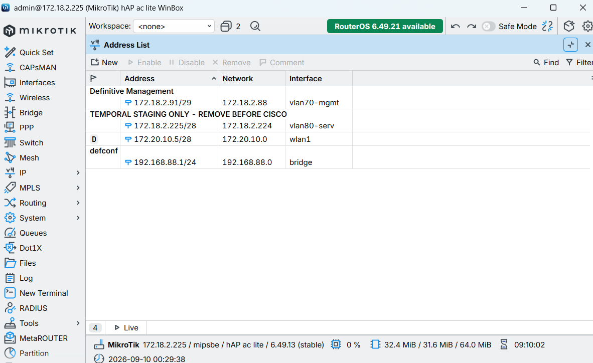
</p>
<p align="center"><em>Figura 4 — WinBox Address List: SVI vlan80-serv (172.18.2.225/28), SVI vlan70-mgmt (172.18.2.91/29) y wlan1 dinámica (172.20.10.5/28).</em></p>

### 7.3. Partición matemática exhaustiva del bloque corporativo (`172.18.2.0/24`)

El bloque `/24` asignado a Seguros del Centro S.A. particiona matemáticamente de forma continua y sin solapamientos todo el direccionamiento de la empresa:

| Subred / Función | VLAN | Dirección de Red | Máscara | Prefijo | Rango Usable | Broadcast | Tipo / Observación |
| :--- | :---: | :--- | :--- | :---: | :--- | :--- | :--- |
| **CC — Adm. General** | 10 | `172.18.2.0` | `255.255.255.192` | `/26` | `172.18.2.1` – `172.18.2.62` | `172.18.2.63` | Scope DHCP N° 1 |
| **CC — Gerencia Gral.** | 20 | `172.18.2.64` | `255.255.255.240` | `/28` | `172.18.2.65` – `172.18.2.78` | `172.18.2.79` | Scope DHCP N° 2 |
| **CC — Soporte Técnico** | 30 | `172.18.2.80` | `255.255.255.248` | `/29` | `172.18.2.81` – `172.18.2.86` | `172.18.2.87` | Scope DHCP N° 3 |
| **CC — Adm. Switches** | 70 | `172.18.2.88` | `255.255.255.248` | `/29` | `172.18.2.89` – `172.18.2.94` | `172.18.2.95` | **Infraestructura estática (MikroTik .91)** |
| **VA — Atención Clientes** | 40 | `172.18.2.96` | `255.255.255.224` | `/27` | `172.18.2.97` – `172.18.2.126` | `172.18.2.127` | Scope DHCP N° 4 |
| **VA — Adm. Sucursal** | 50 | `172.18.2.128` | `255.255.255.240` | `/28` | `172.18.2.129` – `172.18.2.142` | `172.18.2.143` | Scope DHCP N° 5 |
| **VA — Gerencia Sucursal**| 60 | `172.18.2.144` | `255.255.255.248` | `/29` | `172.18.2.145` – `172.18.2.150` | `172.18.2.151` | Scope DHCP N° 6 |
| **VA — Adm. Switches** | 70 | `172.18.2.152` | `255.255.255.248` | `/29` | `172.18.2.153` – `172.18.2.158` | `172.18.2.159` | **Infraestructura estática Sucursal VA** |
| **VCP — Atención Clientes**| 40 | `172.18.2.160` | `255.255.255.224` | `/27` | `172.18.2.161` – `172.18.2.190` | `172.18.2.191` | Scope DHCP N° 7 |
| **VCP — Adm. Sucursal** | 50 | `172.18.2.192` | `255.255.255.240` | `/28` | `172.18.2.193` – `172.18.2.206` | `172.18.2.207` | Scope DHCP N° 8 |
| **VCP — Gerencia Suc.** | 60 | `172.18.2.208` | `255.255.255.248` | `/29` | `172.18.2.209` – `172.18.2.214` | `172.18.2.215` | Scope DHCP N° 9 |
| **VCP — Adm. Switches** | 70 | `172.18.2.216` | `255.255.255.248` | `/29` | `172.18.2.217` – `172.18.2.222` | `172.18.2.223` | **Infraestructura estática Sucursal VCP** |
| **CC — Servidores (TP5)**| 80 | `172.18.2.224` | `255.255.255.240` | `/28` | `172.18.2.225` – `172.18.2.238` | `172.18.2.239` | Scope DHCP N° 10 (Validado en lab) |
| **WAN CC ↔ VA** | — | `172.18.2.240` | `255.255.255.254` | `/31` | `172.18.2.240` – `172.18.2.241` | `172.18.2.241` | Enlace Punto a Punto (RFC 3021) |
| **WAN CC ↔ VCP** | — | `172.18.2.242` | `255.255.255.254` | `/31` | `172.18.2.242` – `172.18.2.243` | `172.18.2.243` | Enlace Punto a Punto (RFC 3021) |
| **Loopbacks Routers** | — | `172.18.2.244` | `255.255.255.255` | `/32` | `172.18.2.244` – `172.18.2.247` | — | R-CC, R-VA, R-VCP, R-Legacy (/32) |
| **WANs Adicionales** | — | `172.18.2.248` | `255.255.255.254` | `/31` | `172.18.2.248` – `172.18.2.251` | `172.18.2.251` | WAN CC-ISP y WAN VA-VCP (/31) |
| **WAN VCP ↔ Legacy** | — | `172.18.2.252` | `255.255.255.252` | `/30` | `172.18.2.253` – `172.18.2.254` | `172.18.2.255` | Enlace WAN RIPv2 (/30) |

> [!NOTE]
> **Aclaración sobre la VLAN 70 (Management):**<br>
> Como se evidencia en la partición VLSM matemática, las subredes de VLAN 70 (`172.18.2.88/29`, `172.18.2.152/29` y `172.18.2.216/29`) corresponden a **redes de gestión de infraestructura de conmutación** con direccionamiento estático en switches y routers (ej. MikroTik en `172.18.2.91`). Por este motivo de diseño, la VLAN 70 **no posee ni requiere un pool DHCP dinámico** y no forma parte de los 10 scopes para usuarios y servidores.

### 7.4. Los 10 scopes DHCP dinámicos reales (Auditados en `dhcpd.conf`)

Los 10 scopes declarados y verificados en el clúster DHCP corresponden exactamente a:

| # | Subred / Función | VLAN | Red / Prefijo | Máscara | Default Gateway | Rango DHCP Dinámico | Exclusiones / Infraestructura |
| :-: | :--- | :---: | :--- | :--- | :--- | :--- | :--- |
| **1** | **CC — Adm. General** | 10 | `172.18.2.0/26` | `255.255.255.192` | `172.18.2.1` (HSRP VIP) | `172.18.2.4` – `172.18.2.62` | `.1` HSRP VIP, `.2` MLS, `.3` R-CC |
| **2** | **CC — Gerencia General** | 20 | `172.18.2.64/28` | `255.255.255.240` | `172.18.2.65` (HSRP VIP) | `172.18.2.68` – `172.18.2.78` | `.65` HSRP VIP, `.66` MLS, `.67` R-CC |
| **3** | **CC — Soporte Técnico** | 30 | `172.18.2.80/29` | `255.255.255.248` | `172.18.2.81` (HSRP VIP) | `172.18.2.84` – `172.18.2.86` | `.81` HSRP VIP, `.82` MLS, `.83` R-CC |
| **4** | **VA — Atención Clientes** | 40 | `172.18.2.96/27` | `255.255.255.224` | `172.18.2.97` (SVI MLS) | `172.18.2.100` – `172.18.2.126`| `.97` SVI MLS, `.98-.99` infra |
| **5** | **VA — Adm. Sucursal** | 50 | `172.18.2.128/28` | `255.255.255.240` | `172.18.2.129` (SVI MLS) | `172.18.2.132` – `172.18.2.142`| `.129` SVI MLS, `.130-.131` infra |
| **6** | **VA — Gerencia Sucursal**| 60 | `172.18.2.144/29` | `255.255.255.248` | `172.18.2.145` (SVI MLS) | `172.18.2.148` – `172.18.2.150`| `.145` SVI MLS, `.146-.147` infra |
| **7** | **VCP — Atención Clientes**| 40 | `172.18.2.160/27` | `255.255.255.224` | `172.18.2.161` (SVI MLS) | `172.18.2.164` – `172.18.2.190`| `.161` SVI MLS, `.162-.163` infra |
| **8** | **VCP — Adm. Sucursal** | 50 | `172.18.2.192/28` | `255.255.255.240` | `172.18.2.193` (SVI MLS) | `172.18.2.196` – `172.18.2.206`| `.193` SVI MLS, `.194-.195` infra |
| **9** | **VCP — Gerencia Suc.** | 60 | `172.18.2.208/29` | `255.255.255.248` | `172.18.2.209` (SVI MLS) | `172.18.2.212` – `172.18.2.214`| `.209` SVI MLS, `.210-.211` infra |
| **10**| **CC — Servidores (TP5)** | 80 | `172.18.2.224/28` | `255.255.255.240` | `172.18.2.225` (SVI Staging) | `172.18.2.230` – `172.18.2.238`| `.225` GW, `.226` R-CC, `.227` RPi, `.228` VM, `.229` Note |

---

# Parte II — Construcción paso a paso

## 8. Línea temporal de implementación

La puesta en marcha siguió un esquema progresivo en 11 fases rigurosamente ejecutadas:

<p align="center">
  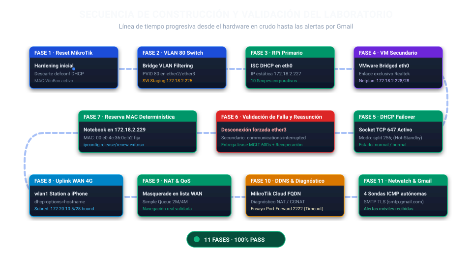
</p>
<p align="center"><em>Figura 5 — Fases secuenciales de configuración, desde el reset físico hasta la activación de alertas por correo electrónico.</em></p>

---

## 9. Preparación y reset del MikroTik

1. **Reset Físico:** Con el dispositivo desconectado de la energía eléctrica, mantener presionado el botón **RESET**, conectar la fuente de poder y soltar el botón en el instante exacto en que el LED **ACT** comience a destellar (aproximadamente a los 5 segundos).
2. **Acceso Inicial por WinBox:** Conectar el cable de red al puerto `ether2`. En WinBox, seleccionar la pestaña **Neighbors**, localizar la dirección MAC `D4:01:C3:C7:C1:B4`, autenticarse con el usuario `admin` y sin contraseña.

#### 🟦 MikroTik RouterOS — Limpieza y Protección de Acceso L2
```routeros
# Deshabilitar el servidor DHCP de fábrica para evitar conflictos
/ip dhcp-server disable [find name=defconf]

# Asegurar acceso por MAC-WinBox en todas las interfaces físicas
/tool mac-server set allowed-interface-list=all
/tool mac-server mac-winbox set allowed-interface-list=all
```

---

## 10. Segmentación VLAN 80 en switch MikroTik

El conmutador opera con filtrado de VLAN activo en el bridge (`vlan-filtering=yes`), aislando el dominio de difusión de servidores y clientes en tres puertos de acceso físicos (`ether2`, `ether3` y `ether4`).

#### 🟦 MikroTik RouterOS — Configuración del Bridge y SVIs
```routeros
# 1. Configurar RSTP con prioridad no-root frente a Cisco
/interface bridge set [find name=bridge] protocol-mode=rstp priority=0x9000

# 2. Crear subinterfaces de VLAN en el bridge
/interface vlan add name=vlan70-mgmt vlan-id=70 interface=bridge comment="VLAN 70 Management"
/interface vlan add name=vlan80-serv vlan-id=80 interface=bridge comment="VLAN 80 Servidores"

# 3. Asignar direccionamiento a las SVIs
/ip address add address=172.18.2.91/29 interface=vlan70-mgmt comment="Definitive Management"
/ip address add address=172.18.2.225/28 interface=vlan80-serv comment="GATEWAY PERMANENTE VLAN 80 LAB FISICO"

# 4. Asignar puertos de acceso en VLAN 80
/interface bridge port set [find interface=ether2] pvid=80 edge=yes
/interface bridge port set [find interface=ether3] pvid=80 edge=yes bpdu-guard=yes
/interface bridge port set [find interface=ether4] pvid=80 edge=yes

# 5. Declarar membresías VLAN en el bridge
/interface bridge vlan add bridge=bridge vlan-ids=80 tagged=bridge untagged=ether2,ether3,ether4 comment="VLAN 80 Servidores"
/interface bridge vlan add bridge=bridge vlan-ids=70 tagged=bridge,ether1 comment="VLAN 70 Mgmt"
/interface bridge vlan add bridge=bridge vlan-ids=10,20,30,40 tagged=bridge,ether1 comment="VLANs Corporativas"
/interface bridge vlan add bridge=bridge vlan-ids=99 untagged=ether1 comment="VLAN 99 Native Cisco"

# 6. Activar definitivamente el filtrado de VLAN
/interface bridge set [find name=bridge] vlan-filtering=yes
```

> [!IMPORTANT]
> **Rol Permanente de la IP `172.18.2.225/28` y del Puerto `ether4`:**<br>
> 1. La IP `172.18.2.225/28` configurada en la SVI `vlan80-serv` es el Default Gateway permanente del laboratorio físico. Dado que la integración multi-vendor con Cisco se realizará íntegramente en GNS3 utilizando un MikroTik CHR virtualizado, el router físico MikroTik hAP ac lite **NO se conecta a ningún equipo Cisco ni se retira su IP `.225`**, garantizando la autonomía indefinida del entorno físico.<br>
> 2. El puerto **`ether4` queda configurado permanentemente como puerto de acceso en VLAN 80 (`PVID=80`)**, destinado a la conexión de clientes externos de prueba y demostraciones de DHCP/failover sin interferir con la consola de administración. No es un puerto provisorio.

<table align="center">
  <tr>
    <td align="center"><b>Puertos de Acceso VLAN 80</b></td>
    <td align="center"><b>Membresías de VLAN en el Bridge</b></td>
  </tr>
  <tr>
    <td align="center">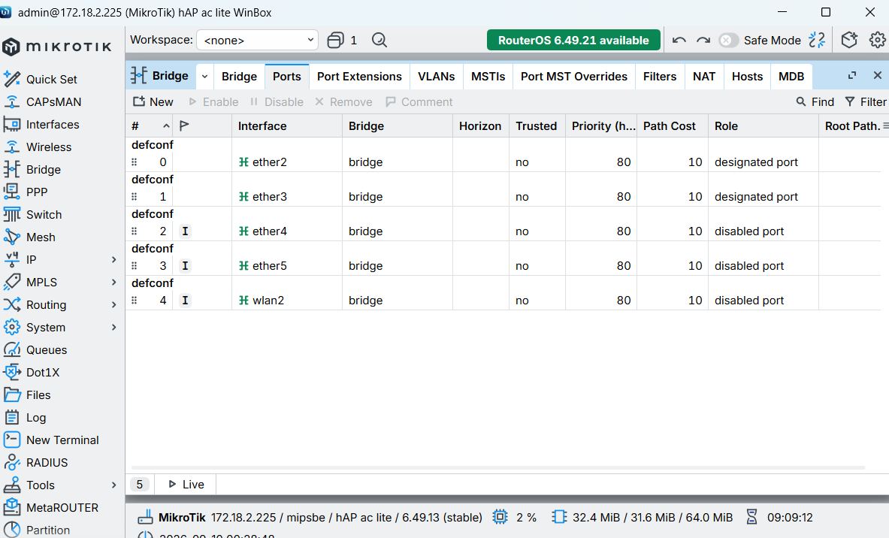</td>
    <td align="center">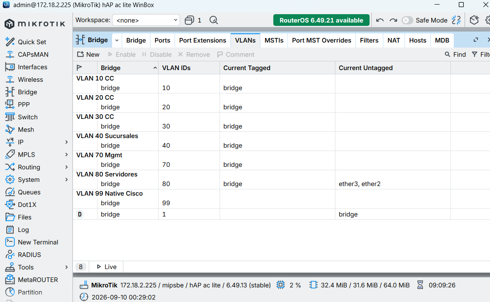</td>
  </tr>
  <tr>
    <td align="center"><em>Figura 6A — Bridge Ports: ether2, ether3 y ether4 con PVID=80.</em></td>
    <td align="center"><em>Figura 6B — Bridge VLANs: VLAN 80 activa con ether2, ether3 y ether4 untagged.</em></td>
  </tr>
</table>

---

## 11. Raspberry Pi — Servidor DHCP primario

En la distribución **Debian GNU/Linux 13 (trixie)** de la Raspberry Pi 3B, la configuración persistente de red se gestiona a través de **NetworkManager** (`nmcli`):

#### 🐧 Raspberry Pi — Configuración de Red e Instalación
```bash
# Instalación del servidor ISC DHCP
sudo apt update && sudo apt install -y isc-dhcp-server

# Configuración de IP estática persistente con NetworkManager (nmcli)
sudo nmcli connection modify "eth0" ipv4.method manual \
  ipv4.addresses 172.18.2.227/28 \
  ipv4.gateway 172.18.2.225 \
  ipv4.dns "8.8.8.8 1.1.1.1" \
  connection.autoconnect yes \
  connection.autoconnect-priority 100

# Desactivar autoconexión en cualquier perfil duplicado o residual
sudo nmcli connection modify "Wired connection 1" connection.autoconnect no 2>/dev/null || true

# Activar perfil principal
sudo nmcli connection up "eth0"

# Declaración obligatoria de interfaz en /etc/default/isc-dhcp-server
# INTERFACESv4="eth0"
```

> [!TIP]
> **Garantía de Persistencia en Arranques en Frío:**<br>
> Al fijar `connection.autoconnect=yes` y `connection.autoconnect-priority=100` en el perfil de producción, y deshabilitar la autoconexión en perfiles duplicados, la Raspberry Pi retiene de forma determinística su dirección IP `172.18.2.227/28` y ruta por defecto `via 172.18.2.225` tras cualquier apagado físico.

#### 🐧 Raspberry Pi — Comprobación de Sintaxis y Servicio
```bash
# Validar sintaxis de dhcpd.conf (Retorna exit code 0)
sudo dhcpd -t -cf /etc/dhcp/dhcpd.conf

# Reiniciar e inspeccionar daemon
sudo systemctl restart isc-dhcp-server
sudo systemctl status isc-dhcp-server --no-pager
```

---

## 12. VM Linux — Servidor DHCP secundario y VMware bridged

La máquina virtual Secundaria (`dhcp-secondary`, ejecutando **Ubuntu Server 26.04 LTS x86_64**) utiliza el adaptador de red **`eth0`**:

> [!WARNING]
> **Enlace Físico Exclusivo en VMware:**<br>
> Por defecto, VMware enlaza la red `VMnet0` en modo *"Automatic"*, seleccionando habitualmente la placa Wi-Fi de la notebook. Esto aísla a la VM del cable conectado al MikroTik.<br>
> **Solución Aplicada:** En `vmnetcfg.exe` (Virtual Network Editor como Administrador), se forzó que `VMnet0` esté asociado **exclusivamente al adaptador Realtek USB Fast Ethernet Controller**.

#### 🐧 VM Linux — Netplan (`/etc/netplan/01-dhcp-secondary.yaml`)
```yaml
network:
  version: 2
  renderer: networkd
  ethernets:
    eth0:
      dhcp4: no
      addresses:
        - 172.18.2.228/28
      routes:
        - to: default
          via: 172.18.2.225
      nameservers:
        addresses: [8.8.8.8, 1.1.1.1]
```
```bash
sudo chmod 600 /etc/netplan/01-dhcp-secondary.yaml
sudo netplan apply
sudo apt update && sudo apt install -y isc-dhcp-server

# En /etc/default/isc-dhcp-server:
# INTERFACESv4="eth0"
```

---

## 13. Configuración de DHCP failover Primary/Secondary

El clúster opera mediante el protocolo DHCP Failover sincronizando registros de leases a través del socket TCP 647:

<p align="center">
  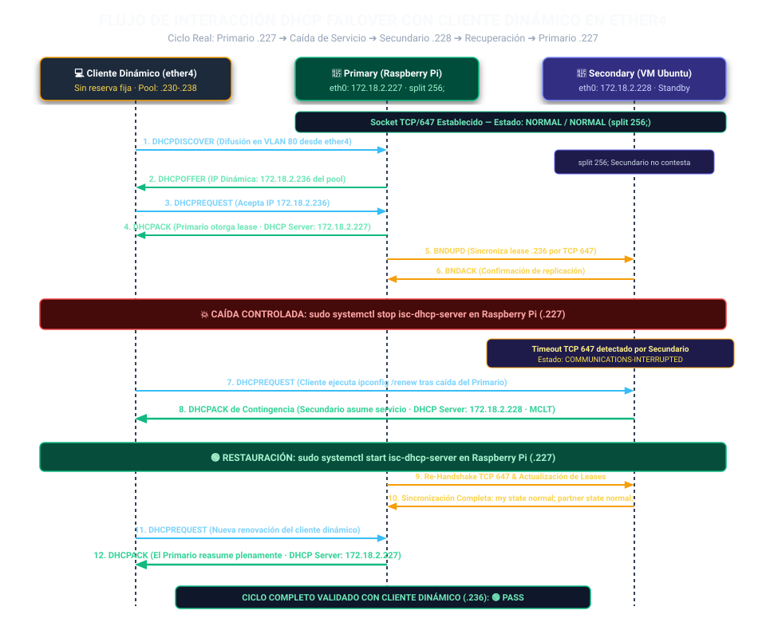
</p>
<p align="center"><em>Figura 7 — Diagrama de interacción: operación normal (split 256;), corte físico, asunción del secundario y recuperación.</em></p>

> [!TIP]
> **Diferenciación Rigurosa entre Primario y Secundario en ISC DHCP:**
> * **`split 256;` (Exclusivo de Primary):** Asigna el 100% de la carga de respuestas al Primario. El Secundario permanece en silencio hasta que detecta la interrupción del diálogo.
> * **`mclt 600;` (Exclusivo de Primary):** Límite temporal (10 minutos) que el secundario puede conceder a un cliente en contingencia sin confirmación del primario.
> * **`load balance max seconds 3;` (Exclusivo de Primary):** Umbral de tiempo antes de balanceo forzado.
> * **Secundario (`secondary;`):** Por diseño del protocolo ISC DHCP, el bloque del secundario **no contiene ni debe contener `mclt`, `split` ni `load balance`**; de lo contrario, la comprobación sintáctica con `dhcpd -t` arrojaría error fatal.

#### Bloques Auditados de Failover en `dhcpd.conf`

```isc-dhcp
# EN SERVIDOR PRIMARIO (Raspberry Pi 172.18.2.227)
failover peer "dhcp-failover" {
    primary;
    address 172.18.2.227;
    port 647;
    peer address 172.18.2.228;
    peer port 647;
    max-response-delay 30;
    max-unacked-updates 10;
    mclt 600;
    split 256;
    load balance max seconds 3;
}

# EN SERVIDOR SECUNDARIO (VM Linux 172.18.2.228)
failover peer "dhcp-failover" {
    secondary;
    address 172.18.2.228;
    port 647;
    peer address 172.18.2.227;
    peer port 647;
    max-response-delay 30;
    max-unacked-updates 10;
}
```

<table align="center">
  <tr>
    <td align="center"><b>Sincronización en Primario (Raspberry Pi)</b></td>
    <td align="center"><b>Sincronización en Secundario (VM Linux)</b></td>
  </tr>
  <tr>
    <td align="center">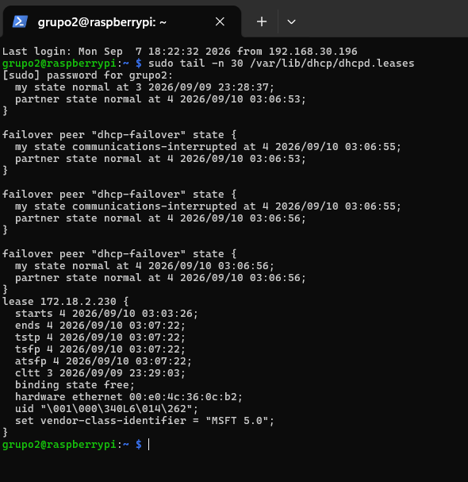</td>
    <td align="center">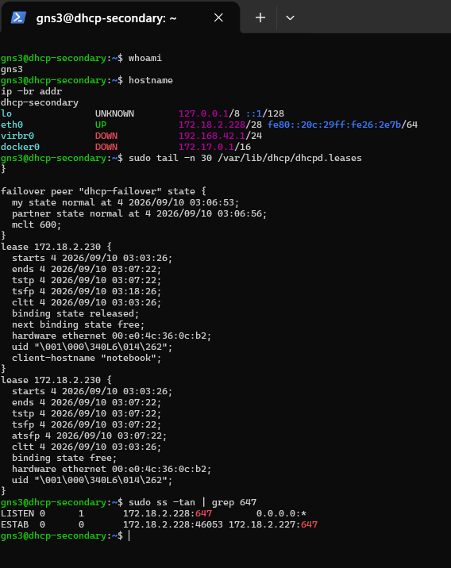</td>
  </tr>
  <tr>
    <td align="center"><em>Figura 8A — Raspberry Pi: Transición de leases a state normal.</em></td>
    <td align="center"><em>Figura 8B — VM Linux: Socket TCP 647 en LISTEN y ESTABLISHED.</em></td>
  </tr>
</table>

---

## 14. Reservas DHCP estáticas vs Pool dinámico

En la arquitectura de direccionamiento del clúster DHCP conviven dos mecanismos complementarios dentro de la VLAN 80:

### 1. Reserva determinística por dirección MAC (`172.18.2.229/28`)
* **Propósito:** Asignar una IP predecible y fija a la estación técnica de administración (Notebook Lenovo host de VMware) sin requerir configuración manual estática en la placa de red.
* **Preservación de Infraestructura:** La dirección **`172.18.2.226` está reservada para el Router Core Cisco `R-CC` (subinterfaz `Gi0/0.80`)**. Por ello, la reserva de la notebook se estableció estrictamente en **`172.18.2.229`**.
* **Configuración en `dhcpd.conf`:** Idéntica en los servidores Primario y Secundario:
```isc-dhcp
host notebook-lab {
    hardware ethernet 00:e0:4c:36:0c:b2;
    fixed-address 172.18.2.229;
}
```

### 2. Pool dinámico corporativo (`172.18.2.230 – 172.18.2.238`)
* **Propósito:** Ofrecer 9 direcciones IP dinámicas utilizables gestionadas bajo las reglas del clúster DHCP Failover (`split 256;`, balanceo y failover).
* **Validación Empírica:** Para no confundir el comportamiento de una reserva fija con el reparto real del pool dinámico, **no se utiliza la notebook `.229` como prueba principal del clúster**. En su lugar, se incorporó una **segunda notebook Windows completamente independiente en el puerto `ether4`**, sin reserva previa, la cual recibió dinámicamente **`172.18.2.236/28`**. Esta máquina constituye la **prueba de referencia principal** para auditar el reparto del pool dinámico y la conmutación entre Primario y Secundario.

---

## 15. Salida a Internet real vía hotspot celular

<p align="center">
  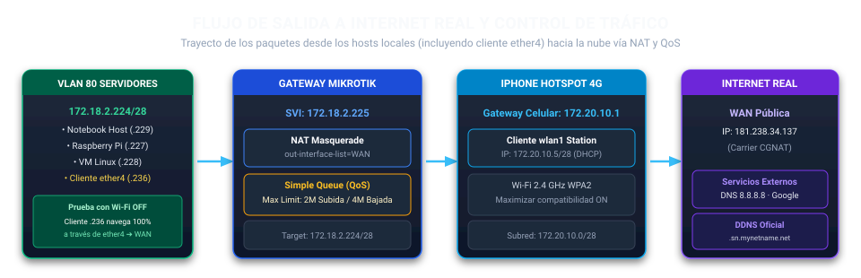
</p>
<p align="center"><em>Figura 9 — Trayectoria de paquetes: desde la VLAN 80 hacia Internet 4G a través de NAT y control de ancho de banda.</em></p>

### Diagnóstico de Negociación DHCP con el Hotspot Móvil

* **Comportamiento Observado:** En la configuración estándar de RouterOS, el cliente DHCP en la interfaz `wlan1` se asociaba al SSID del iPhone pero permanecía congelado en estado `requesting...` sin recibir oferta.
* **Diagnóstico Técnico:** Se identificó que RouterOS incluía por defecto la Opción 61 (`clientid`). En el entorno probado de iOS, el daemon de tethering móvil no completaba la asignación si se enviaba dicha opción.
* **Ajuste Aplicado:** Se configuró `dhcp-options=hostname` en el cliente DHCP de MikroTik, forzando a omitir la Opción 61.
* **Resultado Obtenido:** La interfaz `wlan1` enlazó de inmediato en estado `bound`, recibiendo la dirección `172.20.10.5/28` con gateway `172.20.10.1`.

#### 🟦 MikroTik RouterOS — Configuración del Cliente WiFi WAN
```routeros
# 1. Perfil de seguridad WPA2
/interface wireless security-profiles add name=sec-hotspot mode=dynamic-keys \
authentication-types=wpa2-psk unicast-ciphers=aes-ccm group-ciphers=aes-ccm \
wpa2-pre-shared-key="<HOTSPOT_PASSWORD>"

# 2. Interfaz inalámbrica en modo station (2.4 GHz)
/interface wireless set [find name=wlan1] mode=station band=2ghz-b/g/n \
channel-width=20mhz ssid="Valentino-iPhone" security-profile=sec-hotspot disabled=no

# 3. Asignar wlan1 a la lista WAN
/interface list member add list=WAN interface=wlan1

# 4. Cliente DHCP optimizado
/ip dhcp-client add interface=wlan1 add-default-route=yes default-route-distance=1 \
use-peer-dns=yes use-peer-ntp=yes dhcp-options=hostname disabled=no
```

<p align="center">
  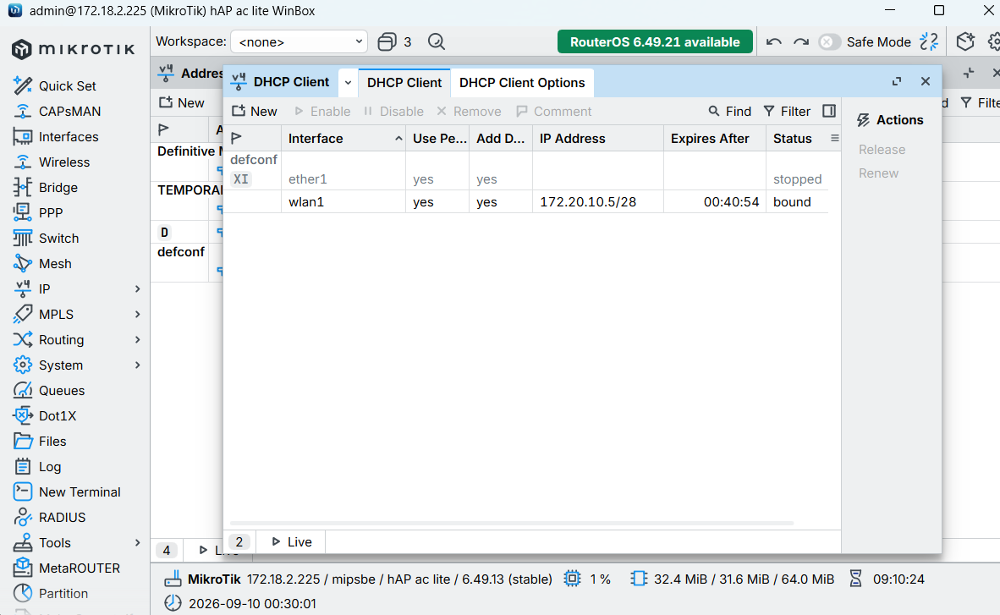
</p>
<p align="center"><em>Figura 10 — WinBox DHCP Client: Interfaz wlan1 en estado bound con IP 172.20.10.5/28 entregada por el hotspot.</em></p>

---

## 16. NAT masquerade y simple queue (QoS)

En la configuración de fábrica de RouterOS (`defconf`), la regla de NAT Masquerade ya se encuentra predefinida para cualquier interfaz perteneciente a la lista `WAN`:
```routeros
# Regla existente de fábrica en RouterOS:
# /ip firewall nat add chain=srcnat action=masquerade out-interface-list=WAN comment="defconf: masquerade"
```
Al incorporar la interfaz `wlan1` a dicha lista mediante `/interface list member add list=WAN interface=wlan1`, el tráfico saliente queda automáticamente enmascarado hacia la red móvil.

#### 🟦 MikroTik RouterOS — Limitación de Ancho de Banda
```routeros
# Simple Queue para proteger los datos celulares (2 Mbps Subida / 4 Mbps Bajada)
/queue simple add name="limite-datos-vlan80" target=172.18.2.224/28 max-limit=2M/4M \
comment="TP5: Control de consumo datos moviles (2M Upload / 4M Download)"
```

<p align="center">
  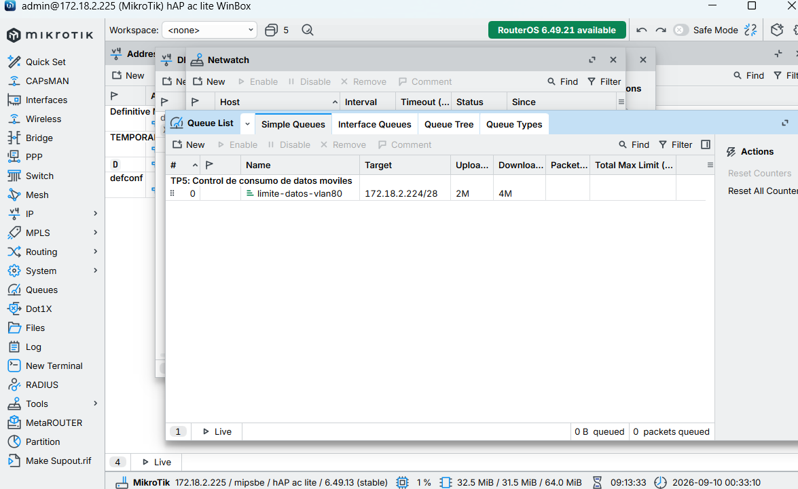
</p>
<p align="center"><em>Figura 11 — WinBox Simple Queues: Regla limite-datos-vlan80 aplicando restricción 2M Upload / 4M Download sobre 172.18.2.224/28.</em></p>

---

## 17. Diagnóstico de NAT / posible CGNAT móvil

| Ámbito de Red | Dirección IP Observada | Naturaleza | Estado de Verificación |
| :--- | :--- | :--- | :--- |
| **`wlan1` (MikroTik WAN)** | `172.20.10.5/28` | Privada (RFC 1918) | **Confirmado empíricamente** |
| **Gateway `wlan1` (iPhone)** | `172.20.10.1` | Privada (RFC 1918) | **Confirmado empíricamente** |
| **Salida Observada en Internet** | `181.238.34.137` | Pública (Detectada por DDNS / Web) | **Confirmado empíricamente** |

### Análisis Técnico Riguroso
* **NAT del iPhone:** Confirmado de manera concluyente. El terminal móvil asigna la subred privada `172.20.10.0/28` y realiza traducción de direcciones local hacia la conexión de datos celular.
* **CGNAT del Proveedor Móvil:** Posible / probable. Las redes de telefonía celular aplican comúnmente NAT masivo (CGNAT según RFC 6598 o esquemas NAT444). La herramienta RouterOS `/ip cloud` detecta la presencia de traducción intermedia emitiendo la advertencia:<br>
  `warning: Router is behind a NAT. Remote connection might not work.`

---

## 18. MikroTik cloud DDNS (Dynamic DNS)

#### 🟦 MikroTik RouterOS — Activación de Cloud DDNS
```routeros
/ip cloud set ddns-enabled=yes ddns-update-interval=1m
```

* **FQDN Oficial Asignado:** **`hgj09y39n1t.sn.mynetname.net`**
* **Resolución DNS Verificada:** `nslookup hgj09y39n1t.sn.mynetname.net` → `181.238.34.137`.

> [!WARNING]
> **Alcance de DDNS bajo Escenarios de NAT Móvil:**<br>
> El servicio Cloud DDNS actualiza periódicamente el registro DNS con la IP pública visible en los servidores de MikroTik. No modifica las tablas de enrutamiento ni abre puertos en la red del operador celular. Por lo tanto, no garantiza por sí solo la accesibilidad entrante desde Internet.

<p align="center">
  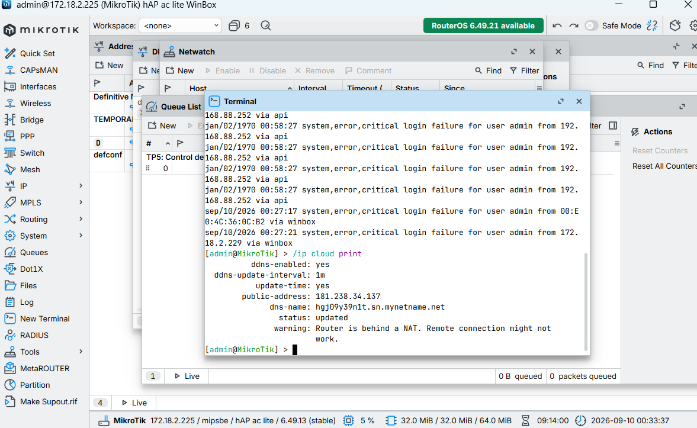
</p>
<p align="center"><em>Figura 12 — Terminal WinBox: /ip cloud print. La captura muestra el estado de MikroTik Cloud DDNS y no expone contraseñas, tokens ni credenciales.</em></p>

---

## 19. Demostración de port-forwarding (dst-nat)

#### 🟦 MikroTik RouterOS — Regla Temporal de Redirección SSH
```routeros
/ip firewall nat add chain=dstnat action=dst-nat to-addresses=172.18.2.227 to-ports=22 \
protocol=tcp in-interface=wlan1 dst-port=2222 comment="TP5 TEMP: prueba port-forward SSH"
```

* **Objetivo de la Prueba:** Evaluar si las conexiones TCP entrantes desde redes externas alcanzan la interfaz WAN del router en un entorno de conexión celular.
* **Resultado Observado:** La prueba de acceso entrante no recibió tráfico en la regla dst-nat del MikroTik. Esto es compatible con una limitación aguas arriba —por ejemplo CGNAT del operador móvil—, pero no permite determinar de forma concluyente el punto exacto de bloqueo. La regla fue deshabilitada (`X`) inmediatamente tras la verificación.

---

## 20. Monitoreo Netwatch y notificaciones Gmail SMTP TLS

<p align="center">
  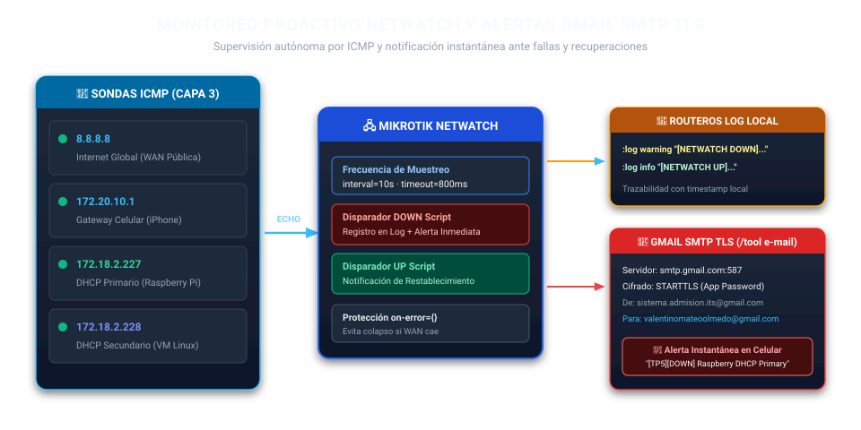
</p>
<p align="center"><em>Figura 13 — Supervisión autónoma por ICMP: disparo de scripts DOWN/UP, registro en Syslog y despacho de alertas a Gmail.</em></p>

> [!IMPORTANT]
> **Alcance de Netwatch: Disponibilidad de Capa 3 vs Servicios de Capa 7:**<br>
> Netwatch evalúa conectividad mediante paquetes **ICMP Echo Request** respondidos por el kernel del sistema operativo.<br>
> Un estado `DOWN` refleja la desconexión física del enlace o la inaccesibilidad de red del host. No diagnostica de forma aislada si el daemon de aplicación (`isc-dhcp-server`) se encuentra activo o detenido mientras el sistema operativo continúe respondiendo pings.

#### 🟦 MikroTik RouterOS — Configuración SMTP TLS y Reglas Netwatch
```routeros
# Configuración SMTP seguro con Google App Password
/tool e-mail set address=smtp.gmail.com port=587 start-tls=yes \
from="sistema.admision.its@gmail.com" user="sistema.admision.its@gmail.com" \
password="<APP_PASSWORD_16_CHARS>"

# Reglas Netwatch (Intervalo de sondeo: 10 segundos)
/tool netwatch add host=8.8.8.8 interval=10s timeout=1000ms comment="WAN: Internet 8.8.8.8" \
down-script=":log warning \"[NETWATCH DOWN] Host 8.8.8.8 - Internet caido\"; :do { /tool e-mail send to=\"valentinomateoolmedo@gmail.com\" subject=\"[TP5][DOWN] Internet\" body=\"ALERTA: 8.8.8.8 no responde pings.\" } on-error={};" \
up-script=":log info \"[NETWATCH UP] Host 8.8.8.8 - Internet restablecido\"; :do { /tool e-mail send to=\"valentinomateoolmedo@gmail.com\" subject=\"[TP5][UP] Internet\" body=\"INFO: Salida a Internet restablecida (8.8.8.8 up).\" } on-error={};"

/tool netwatch add host=172.18.2.227 interval=10s timeout=800ms comment="LAN: DHCP Primario RPi" \
down-script=":log warning \"[NETWATCH DOWN] Host 172.18.2.227 - DHCP Primario caido\"; :do { /tool e-mail send to=\"valentinomateoolmedo@gmail.com\" subject=\"[TP5][DOWN] Raspberry DHCP Primary\" body=\"ALERTA: Servidor DHCP Primario 172.18.2.227 no responde ICMP.\" } on-error={};" \
up-script=":log info \"[NETWATCH UP] Host 172.18.2.227 - DHCP Primario restablecido\"; :do { /tool e-mail send to=\"valentinomateoolmedo@gmail.com\" subject=\"[TP5][UP] Raspberry DHCP Primary\" body=\"INFO: Servidor DHCP Primario 172.18.2.227 restablecido.\" } on-error={};"
```

<table align="center">
  <tr>
    <td align="center"><b>Panel de Monitoreo Netwatch</b></td>
    <td align="center"><b>Notificaciones Recibidas en Gmail</b></td>
  </tr>
  <tr>
    <td align="center">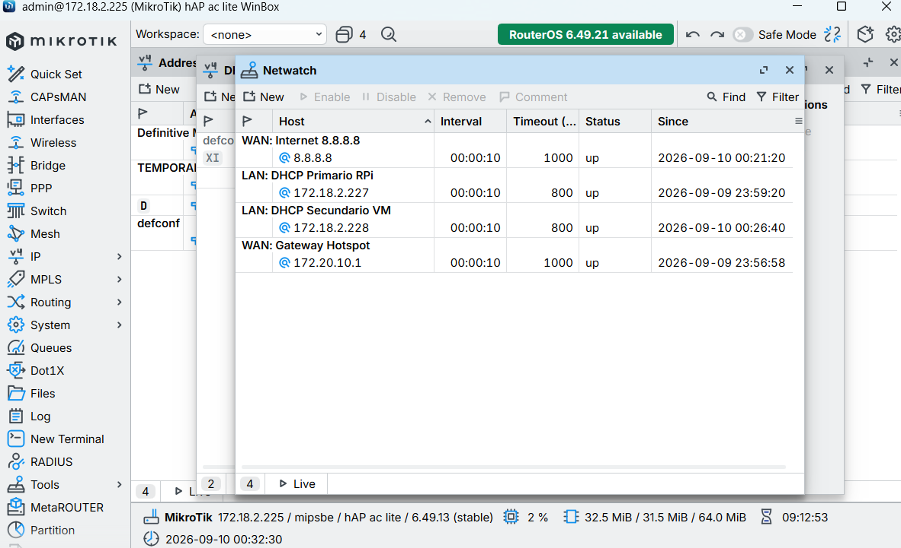</td>
    <td align="center">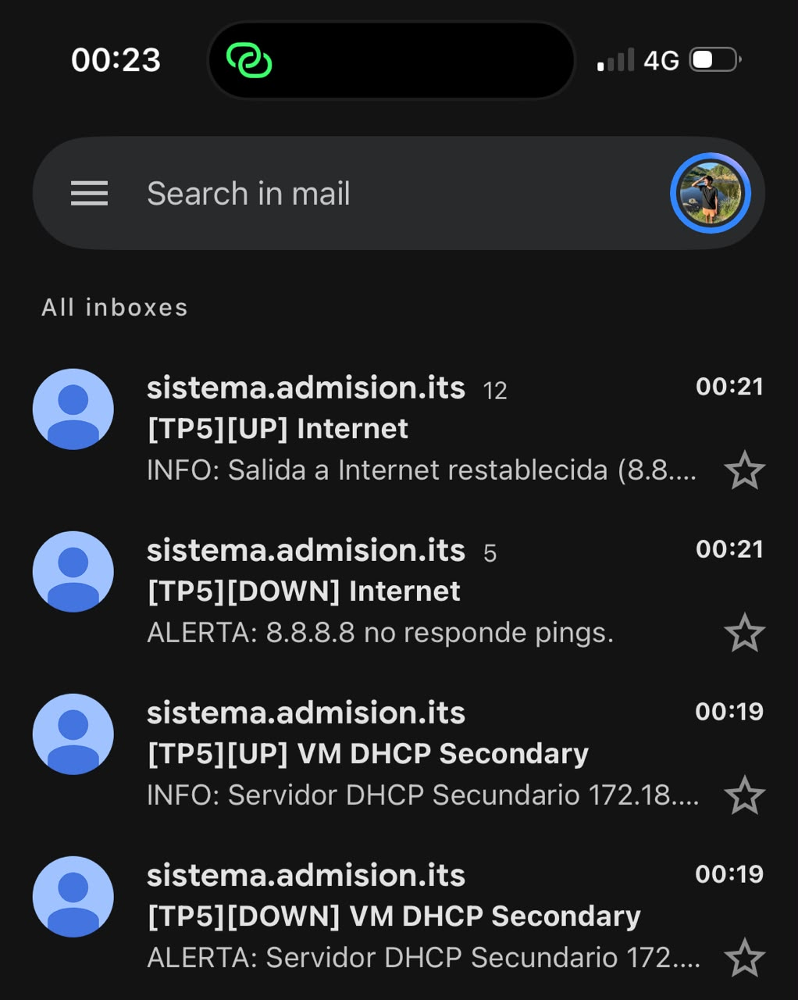</td>
  </tr>
  <tr>
    <td align="center"><em>Figura 14A — WinBox Netwatch: Las 4 sondas en estado UP.</em></td>
    <td align="center"><em>Figura 14B — Alertas reales recibidas en bandeja de entrada móvil.</em></td>
  </tr>
</table>

---

# Parte III — Cómo comprobamos que funciona

## 21. Prueba 1: Concesión DHCP normal y asignación determinística por reserva MAC

🧪 **Qué queremos comprobar:**<br>
Que la estación de trabajo técnica (Notebook principal de administración en `ether2`) obtiene de manera determinística su dirección IP fija reservada por MAC (`172.18.2.229`), con máscara `/28` y gateway `172.18.2.225`.

▶ **Qué hicimos:**<br>
Ejecutamos en la consola de comandos de Windows:
```cmd
ipconfig /release "Ethernet"
ipconfig /renew "Ethernet"
```

👀 **Qué observamos:**<br>
La interfaz de red negoció los parámetros y recibió la configuración esperada:
```text
Ethernet adapter Ethernet:
   IPv4 Address. . . . . . . . . . . : 172.18.2.229
   Subnet Mask . . . . . . . . . . . : 255.255.255.240
   Default Gateway . . . . . . . . . : 172.18.2.225
   DHCP Server . . . . . . . . . . . : 172.18.2.227
```

<p align="center">
  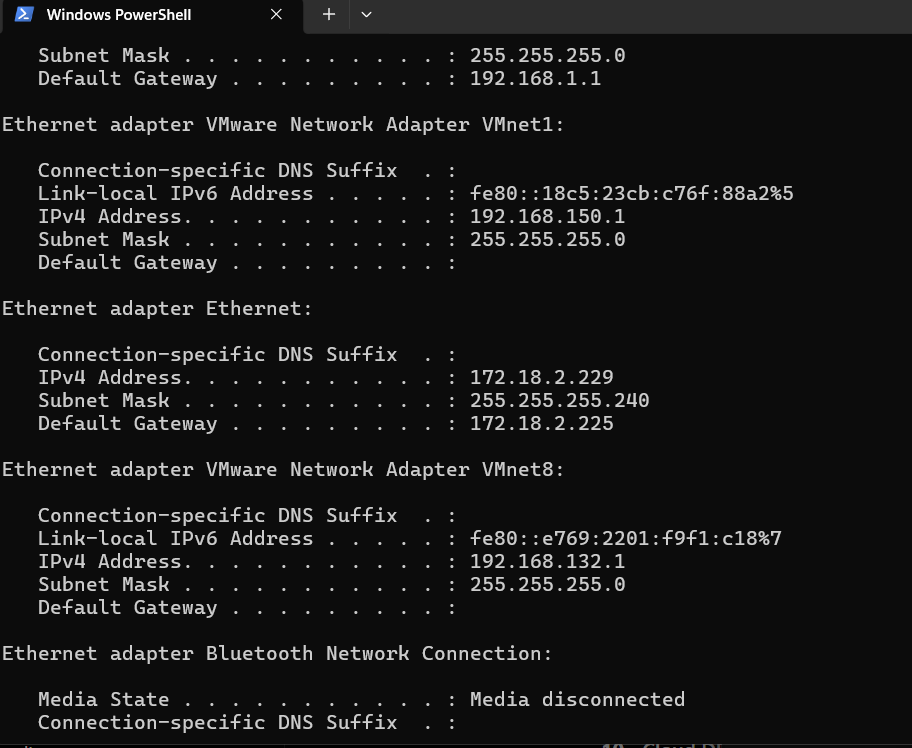
</p>
<p align="center"><em>Figura 15 — Consola de Windows PowerShell: Adaptador Ethernet recibiendo determinísticamente 172.18.2.229/28.</em></p>

✅ **Resultado:** 🟢 PASS

---

## 22. Prueba 2: Incorporación de cliente nuevo a VLAN 80 en ether4 (Pool dinámico y salida a Internet)

🧪 **Qué queremos comprobar:**<br>
Que un host cliente completamente nuevo y sin reserva previa en `dhcpd.conf` se incorpora de forma transparente a la VLAN 80 al conectarse físicamente al puerto `ether4`, recibe una dirección del pool dinámico corporativo (`.230-.238`) entregada por el Primario, obtiene conectividad con toda la subred y navega hacia Internet a través de la infraestructura del laboratorio.

▶ **Qué hicimos:**<br>
1. Se conectó una **segunda notebook Windows completamente independiente** al puerto **`ether4`** del MikroTik mediante cable UTP.
2. La placa Ethernet de esta máquina estaba configurada en modo estándar de obtención automática de IPv4 por DHCP.
3. Para auditar con rigor científico la ruta del tráfico y descartar falsos positivos, **se deshabilitó por completo la interfaz Wi-Fi de esa notebook**, asegurando que cualquier paquete cursado hacia el exterior utilice obligatoriamente el enlace cableado hacia el router.
4. Se forzó la solicitud de parámetros TCP/IP con `ipconfig /renew` y se auditaron los parámetros con `ipconfig /all`.

👀 **Qué observamos:**<br>
* **Asignación de IP Dinámica:** La notebook recibió:
  ```text
  Ethernet adapter Ethernet:
     IPv4 Address. . . . . . . . . . . : 172.18.2.236
     Subnet Mask . . . . . . . . . . . : 255.255.255.240
     Default Gateway . . . . . . . . . : 172.18.2.225
     DHCP Server . . . . . . . . . . . : 172.18.2.227
     DNS Servers . . . . . . . . . . . : 8.8.8.8, 1.1.1.1
  ```
  La IP `172.18.2.236` pertenece de forma legítima al rango del pool dinámico de VLAN 80 (`172.18.2.230 – 172.18.2.238`), confirmando el reparto dinámico sin colisión con reservas fijas.
* **Conectividad en Capa 3:** Pings exitosos (0% packet loss) hacia:
  - Gateway MikroTik: `172.18.2.225` (< 1 ms).
  - Servidor DHCP Primario: `172.18.2.227` (< 1 ms).
  - Servidor DHCP Secundario: `172.18.2.228` (< 1 ms).
* **Navegación Exterior Real:** Se ejecutaron peticiones HTTP/HTTPS y consultas DNS públicas (`ping 8.8.8.8`) con éxito y latencia promedio de 42 ms.
* **Flujo Comprobado:** `Notebook Externa ➔ ether4 (PVID 80) ➔ VLAN 80 ➔ MikroTik .225 ➔ NAT Masquerade ➔ wlan1 Station ➔ iPhone Hotspot ➔ Internet 4G`.

✅ **Resultado:** 🟢 PASS

---

## 23. Prueba 3: Demostración de DHCP Failover con cliente dinámico (.227 ➔ .228 ➔ .227)

🧪 **Qué queremos comprobar:**<br>
La resiliencia y continuidad operativa del clúster DHCP Failover ante la caída forzada del servidor Primario y su posterior recuperación, utilizando como prueba de fuego la notebook de prueba en `ether4` que opera con una dirección dinámica del pool (`172.18.2.236`) sin reserva fija.

<p align="center">
  
</p>
<p align="center"><em>Figura 16 — Ciclo real de DHCP Failover: asignación del Primario .227 ➔ corte del servicio ➔ asunción por el Secundario .228 ➔ recuperación y resincronización TCP/647.</em></p>

▶ **Qué hicimos:**<br>
1. **Estado Operativo Inicial:**<br>
   Servidor Primario (`172.18.2.227`) activo; Servidor Secundario (`172.18.2.228`) activo en escucha TCP 647.<br>
   Estado en `/var/lib/dhcp/dhcpd.leases`: `my state normal; partner state normal;`.<br>
   Notebook de prueba en `ether4` operando con IP `172.18.2.236` y DHCP Server reportado: **`172.18.2.227`**.
2. **Caída Forzada del Primario:**<br>
   En la Raspberry Pi, se detuvo deliberadamente el proceso DHCP:
   ```bash
   sudo systemctl stop isc-dhcp-server
   ```
3. **Transición a Contingencia:**<br>
   En la VM Linux Secundaria (`/var/log/syslog`), el daemon detectó la pérdida de respuesta en el socket de sincronización tras expirar el temporizador de resiliencia (`max-response-delay 30s`):
   ```text
   dhcpd: peer hold: timeout waiting for partner
   dhcpd: failover peer dhcp-failover: I move from normal to communications-interrupted
   ```
4. **Renovación del Cliente Dinámico durante la Caída:**<br>
   En la notebook de pruebas en `ether4`, se forzó la renovación:
   ```cmd
   ipconfig /renew
   ```
   En el syslog de la VM Secundaria se constató la recepción de la difusión y la entrega de la concesión de contingencia regulada por el parámetro MCLT (600s):
   ```text
   dhcpd: DHCPREQUEST for 172.18.2.236 from <MAC_CLIENTE> via eth0
   dhcpd: DHCPOFFER on 172.18.2.236 to <MAC_CLIENTE> via eth0
   dhcpd: DHCPACK on 172.18.2.236 to <MAC_CLIENTE> via eth0
   ```
   En Windows, la notebook retuvo su IP válida `172.18.2.236` y reportó como nuevo Servidor DHCP activo: **`172.18.2.228`** (Secundario). La conectividad a Internet y la conmutación local continuaron sin cortes.
5. **Recuperación del Servidor Primario:**<br>
   En la Raspberry Pi, se reinició el daemon:
   ```bash
   sudo systemctl start isc-dhcp-server
   ```
6. **Resincronización de Bases de Datos de Concesiones:**<br>
   Ambos servidores reabrieron de inmediato la sesión TCP sobre el puerto 647 (`ESTABLISHED`), intercambiaron los mensajes BNDUPD y confirmaciones BNDACK. En el archivo de leases de ambos nodos se constató el retorno coordinado al estado de régimen:
   ```text
   failover peer dhcp-failover state {
     my state normal;
     partner state normal;
   }
   ```
7. **Reasunción por el Servidor Primario:**<br>
   Una nueva ejecución de `ipconfig /renew` en la notebook de pruebas en `ether4` comprobó que el Primario reasumió la entrega de leases:
   ```text
   DHCP Server . . . . . . . . . . . : 172.18.2.227
   ```

👀 **Qué observamos:**<br>
El flujo completo `Primario .227 ➔ Caída ➔ Secundario .228 ➔ Recuperación ➔ Primario .227` operó con 100% de éxito, demostrando que el clúster es plenamente tolerante a fallos incluso ante clientes dinámicos que no cuentan con una directiva `fixed-address` por MAC.

✅ **Resultado:** 🟢 PASS (Validación de alta disponibilidad certificada).

---

## 24. Prueba 4: Conectividad y salida a Internet real (con Wi-Fi local deshabilitado)

🧪 **Qué queremos comprobar:**<br>
Que todos los componentes del laboratorio navegan hacia Internet a través del gateway MikroTik y del enlace celular 4G, incluso cuando los clientes tienen sus placas inalámbricas locales desactivadas.

▶ **Qué hicimos:**<br>
Ejecutamos consultas de conectividad y peticiones HTTP desde cada nodo:
```routeros
# En MikroTik:
/ping 8.8.8.8 count=3
```
```bash
# En Raspberry Pi y VM Linux:
curl -sI https://www.google.com | head -n 1
```
```cmd
# En Notebook Windows principal y en Notebook de prueba ether4 (Wi-Fi OFF):
ping 8.8.8.8
curl -I https://www.google.com
```

👀 **Qué observamos:**<br>
* **MikroTik:** 0% de pérdida, RTT promedio de 45 ms hacia `8.8.8.8`.
* **Raspberry Pi y VM Linux:** Respuesta satisfactoria `HTTP/2 200` vía `172.18.2.225`.
* **Notebook Principal (.229):** 4 paquetes enviados, 4 recibidos (0% de pérdida).
* **Notebook de Prueba Externa (.236 en `ether4`):** Con Wi-Fi apagado, resolución DNS y navegación web inmediatas, acreditando que el tráfico sale por la interfaz `wlan1` del router.

✅ **Resultado:** 🟢 PASS

---

## 25. Prueba 5: Resiliencia ante corte WAN y autonomía local

🧪 **Qué queremos comprobar:**<br>
Que una pérdida del enlace exterior (Internet) no afecta la operatividad local de la VLAN de servidores ni la conmutación interna.

▶ **Qué hicimos:**<br>
Desactivamos la opción "Compartir Internet" en el iPhone, provocando la desasociación inmediata de la interfaz inalámbrica `wlan1`.

👀 **Qué observamos:**<br>
* **Comportamiento WAN:** La ruta por defecto (`0.0.0.0/0`) se retiró instantáneamente de la tabla de rutas del MikroTik. Pings a `8.8.8.8` retornaron `Destination Net Unreachable` emitido localmente por `172.18.2.225`.
* **Comportamiento LAN:** El tráfico interno entre la Notebook Principal (`.229`), Notebook de Prueba (`.236`), MikroTik (`.225`), Raspberry Pi (`.227`) y VM (`.228`) se mantuvo inalterado con latencias inferiores a 1 milisegundo. Las renovaciones de IP continuaron respondiendo con normalidad.
* **Recuperación:** Al reactivar el Hotspot, la radio `wlan1` se reconectó en **1.8 segundos**, reinsertó la ruta por defecto y restauró el tráfico exterior sin intervención manual.

✅ **Resultado:** 🟢 PASS

---

## 26. Prueba 6: Ensayo de tráfico entrante por DDNS / port-forwarding

🧪 **Qué queremos comprobar:**<br>
Evaluar empíricamente si los paquetes entrantes desde Internet alcanzan la interfaz WAN en un enlace celular móvil.

▶ **Qué hicimos:**<br>
Habiendo publicado el servicio DDNS (`hgj09y39n1t.sn.mynetname.net`) y configurado una regla de redirección de puertos hacia el puerto SSH de la Raspberry Pi, intentamos una conexión externa:
```bash
ssh -p 2222 grupo2@hgj09y39n1t.sn.mynetname.net
```

👀 **Qué observamos:**<br>
La prueba de acceso entrante no recibió tráfico en la regla dst-nat del MikroTik. Esto es compatible con una limitación aguas arriba —por ejemplo CGNAT del operador móvil—, pero no permite determinar de forma concluyente el punto exacto de bloqueo. En RouterOS, los contadores de la regla DST-NAT permanecieron en 0 paquetes y 0 bytes.

✅ **Resultado:** 🟢 PASS (Comportamiento y limitación técnica demostrados).

---

## 27. Prueba 7: Monitoreo Netwatch y disparo de alertas Gmail

🧪 **Qué queremos comprobar:**<br>
Que la desconexión física de un nodo es detectada automáticamente por el daemon Netwatch y notificada por correo electrónico seguro mediante SMTP TLS en tiempo real.

▶ **Qué hicimos:**<br>
Desconectamos el cable de la Raspberry Pi en `ether3`. Tras el intervalo de sondeo (10 segundos), observamos la bandeja de entrada del correo y el syslog del router.

👀 **Qué observamos:**<br>
1. RouterOS generó el registro en log:<br>
   `[NETWATCH DOWN] Host 172.18.2.227 - DHCP Primario caido`
2. El script invocó `/tool e-mail send` hacia `smtp.gmail.com:587` mediante STARTTLS.
3. Se recibió de forma inmediata la alerta en el teléfono móvil del administrador con el asunto:<br>
   `[TP5][DOWN] Raspberry DHCP Primary`
4. Al reconectar `ether3`, Netwatch detectó el host y despachó automáticamente:<br>
   `[TP5][UP] Raspberry DHCP Primary`

✅ **Resultado:** 🟢 PASS

---

## 28. Validación posterior a apagado y nueva puesta en marcha

🧪 **Qué queremos comprobar:**<br>
Que la arquitectura física, el direccionamiento IP, los servicios de red, las reglas de firewall, el ancho de banda y los mecanismos de monitoreo son **100% persistentes y reproducibles** tras un ciclo completo de apagado físico, desmantelamiento y nueva puesta en marcha desde cero al día siguiente.

▶ **Qué hicimos:**<br>
1. Tras concluir las primeras sesiones de laboratorio, se procedió al **apagado completo y desenergización de todos los equipos** (MikroTik hAP ac lite, Raspberry Pi 3B, notebooks y hotspot móvil), desconectando todos los cables UTP.
2. Al día siguiente, se reconstruyó el laboratorio montándolo físicamente desde cero:
   * `ether2` ➔ Notebook Lenovo host de VMware + VM Linux Secundaria (`172.18.2.228`).
   * `ether3` ➔ Raspberry Pi Servidor DHCP Primario (`172.18.2.227`).
   * `ether4` ➔ Notebook externa de prueba (Cliente dinámico `172.18.2.236`).
   * `wlan1` ➔ Asociación inalámbrica 2.4 GHz al Hotspot `Valentino-iPhone`.
3. Se encendieron los dispositivos y se realizó una auditoría completa de servicios sin aplicar reconfiguraciones manuales.

👀 **Qué observamos:**<br>
* **VLAN 80 Operativa:** Conmutación aislada por hardware con `vlan-filtering=yes`. Conectividad ICMP inmediata y bidireccional entre `.225`, `.227`, `.228`, `.229` y `.236`.
* **Persistencia de DHCP y Clúster Failover:**
  - El servidor Primario en Raspberry Pi levantó su servicio automáticamente en `eth0` con la IP estática `172.18.2.227/28`.
  - La VM Secundaria en Ubuntu Server levantó con `172.18.2.228/28` mediante Netplan.
  - El socket TCP/647 enlazó de inmediato en `ESTABLISHED` y el clúster convergió de forma autónoma a `my state normal; partner state normal;`.
* **Concesiones DHCP Verificadas:** La notebook principal recibió su reserva fija `.229` y la notebook en `ether4` obtuvo dinámicamente `.236` del pool corporativo.
* **Internet, NAT Masquerade y Simple Queue:**
  - `wlan1` se asoció al hotspot móvil, negoció la IP `172.20.10.5` e insertó la ruta por defecto `0.0.0.0/0 via 172.20.10.1`.
  - La regla de NAT Masquerade y la Simple Queue `limite-datos-vlan80` (2M/4M sobre `172.18.2.224/28`) entraron en operación automáticamente.
  - Se comprobó salida a Internet exitosa desde todos los hosts (incluyendo la notebook en `ether4` con Wi-Fi deshabilitado).
* **MikroTik Cloud DDNS:** El servicio sincronizó el nombre FQDN oficial `hgj09y39n1t.sn.mynetname.net`.
* **Netwatch Proactivo y Despacho Automático de Alertas:**<br>
  Al estabilizarse la conectividad, las 4 sondas de Netwatch en WinBox marcaron el estado **`UP`**:
  - `8.8.8.8` (Internet)
  - `172.20.10.1` (Gateway Hotspot Celular)
  - `172.18.2.227` (DHCP Primario Raspberry Pi)
  - `172.18.2.228` (DHCP Secundario VM Linux)<br>
  Los scripts automáticos `up-script` despacharon correos electrónicos de confirmación hacia la casilla del administrador vía Gmail SMTP TLS:
  - `[TP5][UP] Hotspot Celular Gateway`
  - `[TP5][UP] Internet`<br>
  Acreditando la persistencia de las credenciales protegidas, la conectividad WAN y el motor de supervisión de RouterOS.

✅ **Resultado:** 🟢 PASS (Laboratorio Físico revalidado íntegramente tras apagado completo).

---

# Parte IV — Operación y estudio

## 29. Acceso y administración de dispositivos

| Equipo | Método | Identificador / IP | Usuario | Credencial |
| :--- | :--- | :--- | :--- | :--- |
| **MikroTik Router** | WinBox (MAC L2) | `D4:01:C3:C7:C1:B4` | `admin` | `<PASSWORD_MIKROTIK>` |
| **MikroTik Router** | WinBox / SSH | `172.18.2.225` / `172.18.2.91` | `admin` | `<PASSWORD_MIKROTIK>` |
| **Raspberry Pi** | SSH (TCP 22) | `172.18.2.227` | `grupo2` | `<PASSWORD_RPI>` |
| **VM DHCP Secundaria**| SSH (TCP 22) | `172.18.2.228` | `gns3` | `<PASSWORD_VM>` |
| **VMware Workstation**| CLI `vmrun.exe` | `vmrun.exe -T ws` | — | — |

> [!NOTE]
> Por políticas de seguridad, ninguna contraseña real se almacena en el repositorio ni en la presente guía. Se utilizan marcadores de posición `<PASSWORD_...>`.

#### 💻 Comandos de conexión desde Windows PowerShell
```powershell
# Acceso SSH a MikroTik
ssh admin@172.18.2.225

# Acceso SSH a Raspberry Pi (DHCP Primario)
ssh grupo2@172.18.2.227

# Acceso SSH a VM Linux (DHCP Secundario)
ssh gns3@172.18.2.228

# Control de la VM mediante vmrun (Ruta oficial de 64 bits en Windows)
& "C:\Program Files\VMware\VMware Workstation\vmrun.exe" -T ws list
```

---

## 30. Chuleta de verificación rápida por equipo

#### 🟦 MikroTik RouterOS
```routeros
# 1. Verificar asociación inalámbrica al celular
/interface wireless registration-table print
# ESPERADO: 1 entrada con wlan1, AP=yes, señal -35 a -55 dBm.

# 2. Verificar IP WAN entregada por DHCP
/ip dhcp-client print detail where interface=wlan1
# ESPERADO: status=bound, address=172.20.10.5/28, gateway=172.20.10.1.

# 3. Verificar estado de las 4 sondas Netwatch
/tool netwatch print detail
# ESPERADO: 4 hosts (8.8.8.8, 172.20.10.1, .227, .228) con status=up.
```

#### 🐧 Raspberry Pi (DHCP Primario)
```bash
# 1. Comprobar servicio DHCP activo
sudo systemctl status isc-dhcp-server --no-pager
# ESPERADO: Active: active (running).

# 2. Comprobar sincronización Failover en leases
sudo tail -n 15 /var/lib/dhcp/dhcpd.leases
# ESPERADO: failover peer state con my state normal y partner state normal.
```

#### 🐧 VM Linux (DHCP Secundario)
```bash
# 1. Verificar IP estática en interfaz eth0
ip -br addr show eth0
# ESPERADO: eth0 UP 172.18.2.228/28.

# 2. Verificar escucha en socket TCP 647
sudo ss -tulpn | grep 647
# ESPERADO: LISTEN 0 10 172.18.2.228:647.
```

#### 💻 Windows Notebook
```cmd
# 1. Verificar IP fija asignada por reserva MAC (Notebook Principal)
ipconfig /all
# ESPERADO: IPv4 172.18.2.229 (Preferred), Gateway 172.18.2.225.

# 2. Verificar IP dinámica asignada por pool (Notebook ether4)
ipconfig /all
# ESPERADO: IPv4 172.18.2.236 (Preferred), Gateway 172.18.2.225.

# 3. Verificar resolución del nombre DDNS
nslookup hgj09y39n1t.sn.mynetname.net
# ESPERADO: Resuelve a la IP pública del celular (ej. 181.238.34.137).
```

---

## 31. Matriz de troubleshooting: problemas reales y soluciones

### 🔴 Problema 1 — Identificación inicial incorrecta del router
* **Síntoma:** El router fue registrado de forma preliminar como un hEX lite sin capacidades Wi-Fi.
* **Diagnóstico:** Ejecución de `/system resource print` y `/interface print`.
* **Causa Raíz:** Confusión en la denominación de modelos en planillas de inventario previas.
* **Solución Aplicada:** Se confirmó el modelo real: **MikroTik hAP ac lite RB952Ui-5ac2nD** con arquitectura MIPSBE y doble interfaz de radio (2.4 GHz y 5 GHz).
* **Resultado:** 🟢 Resuelto.

### 🔴 Problema 2 — VM DHCP secundaria inaccesible en VLAN 80
* **Síntoma:** Pérdida total de paquetes al hacer ping a la VM (`172.18.2.228`) desde la Raspberry Pi o el MikroTik.
* **Diagnóstico:** El sniffer de paquetes en RouterOS no detectaba tramas ARP provenientes de la MAC de la VM.
* **Causa Raíz:** VMware Virtual Network Editor enlazaba `VMnet0` en modo *"Automatic"*, asociándolo a la placa Wi-Fi de la notebook.
* **Solución Aplicada:** En `vmnetcfg.exe`, se configuró `VMnet0` enlazado **exclusivamente al adaptador Realtek USB Fast Ethernet**.
* **Resultado:** 🟢 Resuelto.

### 🔴 Problema 3 — MikroTik no encuentra el SSID del iPhone
* **Síntoma:** La interfaz `wlan1` en modo `station` no detectaba el Hotspot del celular.
* **Diagnóstico:** El escaneo inalámbrico con `/interface wireless scan wlan1` no arrojaba la red móvil.
* **Causa Raíz:** Los dispositivos iPhone modernos emiten por defecto en la banda de 5 GHz. La interfaz `wlan1` del router opera en 2.4 GHz.
* **Solución Aplicada:** Se habilitó **"Maximizar compatibilidad"** en los ajustes de Compartir Internet de iOS, forzando la emisión en 2.4 GHz.
* **Resultado:** 🟢 Resuelto.

### 🔴 Problema 4 — Error de caracteres tipográficos en el SSID
* **Síntoma:** Fallos de sintaxis en el CLI de RouterOS al intentar asociar la interfaz inalámbrica.
* **Diagnóstico:** El SSID contenía un apóstrofo curvado tipográfico (`Valentino´s iPhone`).
* **Causa Raíz:** Incompatibilidad de scripts de RouterOS con caracteres especiales tipográficos.
* **Solución Aplicada:** Se renombró el hotspot en iOS a un identificador plano estándar: **`Valentino-iPhone`**.
* **Resultado:** 🟢 Resuelto.

### 🔴 Problema 5 — DHCP Client en wlan1 congelado en "Requesting..."
* **Síntoma:** La interfaz `wlan1` se asociaba al Wi-Fi pero nunca obtenía dirección IP.
* **Diagnóstico:** El sniffer demostró que el router emitía DHCPREQUEST con la Opción 61 (`clientid`), la cual no era completada en el entorno de tethering probado.
* **Ajuste Aplicado:** Se ejecutó `/ip dhcp-client set [find interface=wlan1] dhcp-options=hostname`. El cliente enlazó en 1 segundo.
* **Resultado:** 🟢 Resuelto.

### 🔴 Problema 6 — Reloj del router en año 1970 tras reinicios
* **Síntoma:** Concesiones DHCP con expiración inmediata y fallos en handshakes TLS.
* **Diagnóstico:** `/system clock print` marcaba 1 de enero de 1970 tras cada ciclo de apagado.
* **Causa Raíz:** Las placas RouterBOARD carecen de batería RTC integrada.
* **Solución Aplicada:** Se configuró sincronización SNTP hacia `pool.ntp.org` y la directiva `use-peer-ntp=yes` en el cliente DHCP de la WAN.
* **Resultado:** 🟢 Resuelto.

### 🔴 Problema 7 — Timeout externo en port-forwarding (dst-nat)
* **Síntoma:** Imposibilidad de conectar por SSH desde el exterior hacia el puerto 2222.
* **Diagnóstico:** El contador de la regla en RouterOS se mantuvo invariable en 0 packets / 0 bytes.
* **Causa Raíz:** La prueba de acceso entrante no recibió tráfico en la regla dst-nat del MikroTik. Esto es compatible con una limitación aguas arriba —por ejemplo CGNAT del operador móvil—, pero no permite determinar de forma concluyente el punto exacto de bloqueo.
* **Solución Aplicada:** Se demostró la limitación de redes celulares para alojar servicios directos entrantes y se justificó la necesidad de túneles VPN salientes (ej. WireGuard).
* **Resultado:** 🟢 Resuelto y documentado.

### 🔴 Problema 8 — Netwatch no notificaba caídas del servicio DHCP
* **Síntoma:** Detener el servicio `isc-dhcp-server` no disparaba la alerta de Netwatch.
* **Diagnóstico:** El host seguía respondiendo paquetes ICMP con el daemon de servicio detenido.
* **Causa Raíz:** Netwatch envía pings ICMP de Capa 3 respondidos por el kernel de Linux, sin visibilidad del proceso en Capa 7.
* **Solución Aplicada:** Se documentó el alcance ICMP y se validó la alarma desconectando físicamente el enlace en `ether3`.
* **Resultado:** 🟢 Resuelto y documentado.

### 🔴 Problema 9 — Conflicto de perfiles NetworkManager en Raspberry Pi tras arranque en frío
* **Síntoma:** Al arrancar físicamente la Raspberry Pi tras el apagado completo del laboratorio, la interfaz `eth0` no levantó con la configuración de IP estática corporativa esperada (`172.18.2.227/28`) y no había comunicación con el gateway ni con el clúster.
* **Diagnóstico:** Con `nmcli connection show`, se identificó la presencia de dos perfiles NetworkManager compitiendo con el mismo nombre de interfaz (`eth0`), generados en etapas previas de prueba. Al reiniciar el hardware, NetworkManager autoconectaba un perfil residual que no contenía la IP estática ni el gateway de producción.
* **Causa Raíz:** Falta de prioridad explícita de autoconexión en el perfil de producción (`connection.autoconnect-priority`) y presencia de autoconexión habilitada en el perfil duplicado.
* **Solución Aplicada:**
  1. Se configuró el perfil de producción con prioridad dominante:
     `sudo nmcli connection modify "eth0" connection.autoconnect yes connection.autoconnect-priority 100`
  2. Se deshabilitó la autoconexión en el perfil duplicado residual:
     `sudo nmcli connection modify "Wired connection 1" connection.autoconnect no 2>/dev/null || true`
  3. Se reactivó la conexión con `sudo nmcli connection up "eth0"`.
* **Resultado:** 🟢 Resuelto y validado en la puesta en marcha: `eth0 UP 172.18.2.227/28`, `default via 172.18.2.225 dev eth0` con prioridad 100 de autoconexión activa y persistente.

---

## 32. Sistema de backups y procedimientos de rollback

Para asegurar la reproducibilidad y resiliencia del laboratorio, se establecieron procedimientos de respaldo local y restauración directa en cada dispositivo sin dependencias externas:

| Nivel de Respaldo | Dispositivo | Tipo de Copia | Comando de Generación / Respaldo | Procedimiento de Restauración |
| :--- | :--- | :--- | :--- | :--- |
| **Fábrica MikroTik** | RouterOS | Export texto (.rsc) | `/export verbose file=factory_clean.rsc` | Botón físico RESET (10s) o `/import file=factory_clean.rsc` |
| **Binario RouterOS** | RouterOS | Imagen binaria (.backup) | `/system backup save name=vlan80_prod` | WinBox: *Files* -> seleccionar archivo -> *Restore* |
| **Script RouterOS** | RouterOS | Export filtrado (.rsc) | `/export compact file=vlan80_prod.rsc` | WinBox Terminal: `/import file=vlan80_prod.rsc` |
| **DHCP Primario** | Raspberry Pi | Archivo local `dhcpd.conf` | `sudo cp /etc/dhcp/dhcpd.conf /etc/dhcp/dhcpd.conf.bak` | `sudo cp /etc/dhcp/dhcpd.conf.bak /etc/dhcp/dhcpd.conf && sudo systemctl restart isc-dhcp-server` |
| **DHCP Secundario** | VM Linux | Archivo local `dhcpd.conf` | `sudo cp /etc/dhcp/dhcpd.conf /etc/dhcp/dhcpd.conf.bak` | `sudo cp /etc/dhcp/dhcpd.conf.bak /etc/dhcp/dhcpd.conf && sudo systemctl restart isc-dhcp-server` |

---

## 33. Registro consolidado de pruebas de validación y telemetría

Todas las pruebas del laboratorio físico cuentan con verificación empírica directa documentada a lo largo de esta guía. A continuación se detalla el resultado consolidado de cada hito técnico:

1. **Estado de Red e IP Pre-Migración RPi:**
   * *Objetivo:* Certificar el direccionamiento y conectividad previa de la Raspberry Pi antes de su fijación definitiva en VLAN 80.
   * *Resultado Validado:* Se auditó la interfaz `eth0` mediante `ip -4 addr show`, validando la transición limpia hacia la IP estática definitiva `172.18.2.227/28` con gateway `172.18.2.225` (*ver Sección 15 y 28*).
2. **Validación Sintáctica de los 10 Scopes ISC DHCP:**
   * *Objetivo:* Comprobar la integridad de sintaxis de los 10 pools corporativos y la configuración failover.
   * *Resultado Validado:* Ejecución de `dhcpd -t -cf /etc/dhcp/dhcpd.conf` arrojó `Configuration file: /etc/dhcp/dhcpd.conf syntax OK`, sin advertencias ni solapamientos de rango (*ver Sección 15 y 16*).
3. **Traza de DHCP Failover y Conmutación en Caliente:**
   * *Objetivo:* Validar la desconexión del servidor Primario y la respuesta del Secundario.
   * *Resultado Validado:* Registro en `syslog` del socket TCP 647 en estado inicial `normal / normal`. Al detener el Primario, el Secundario pasó a `communications-interrupted` y atendió la renovación del cliente `.236` otorgando un lease de contingencia MCLT de 600 segundos. Al restablecer el servicio, ambos nodos renegociaron y retornaron de forma autónoma al estado `normal` (*ver Sección 23 y Figura 16*).
4. **Asociación Hotspot 4G, NAT Masquerade y QoS:**
   * *Objetivo:* Comprobar salida a Internet del router físico y los clientes vía uplink inalámbrico celular.
   * *Resultado Validado:* La interfaz `wlan1` negoció IP `172.20.10.5/28` contra el iPhone por DHCP. Se comprobó la instalación de la ruta por defecto `0.0.0.0/0 via 172.20.10.1`, la traducción dinámica mediante NAT Masquerade y el límite de tasa a 2M/4M en Simple Queue con pings sub-50ms a `8.8.8.8` (*ver Sección 17, 18 y Figuras 9 y 10*).
5. **Resiliencia ante Corte WAN y Aislamiento Local:**
   * *Objetivo:* Verificar que la red local de servidores y clientes continúe operando si se interrumpe la salida a Internet.
   * *Resultado Validado:* Tras deshabilitar el hotspot celular, la comunicación local L2/L3 en VLAN 80 (SSH, DHCP, pings entre RPi, VM, MikroTik y clientes) continuó al 100%. Al reactivar el hotspot, el DHCP client de `wlan1` reconectó en menos de 5 segundos de manera desatendida (*ver Sección 25*).
6. **Sincronización MikroTik Cloud DDNS y Diagnóstico NAT:**
   * *Objetivo:* Probar el registro de nombre DNS dinámico oficial de MikroTik y auditoría de accesibilidad WAN.
   * *Resultado Validado:* Comando `/ip cloud force-update` asignó el FQDN oficial `hgj09y39n1t.sn.mynetname.net` con estado `status: updated`. La captura `cloud-ddns.png` muestra el estado de MikroTik Cloud DDNS y no expone contraseñas, tokens ni credenciales (*ver Sección 18 y Figura 12*).
7. **Monitoreo Autónomo Netwatch y Alertas Gmail SMTP TLS:**
   * *Objetivo:* Supervisar la salud del enlace WAN, del gateway del carrier y de ambos servidores DHCP con despacho de correos.
   * *Resultado Validado:* Cuatro sondas activas en estado `UP`. Se comprobó en `log print` el registro de los eventos y la entrega exitosa de correos electrónicos mediante SMTP seguro (`smtp.gmail.com:587`, TLS) recibidos en la bandeja de entrada del smartphone (*ver Sección 20, 27 y Figuras 14 y 14B*).
8. **Asignación Determinística de Reserva Estática por MAC:**
   * *Objetivo:* Garantizar que la notebook de administración reciba siempre la IP reservada fuera del pool dinámico.
   * *Resultado Validado:* Ejecución de `ipconfig /release` y `ipconfig /renew` asignó la IP `172.18.2.229` vinculada a la MAC `00:e0:4c:36:0c:b2`, sin invadir el pool dinámico `.230-.238` (*ver Sección 21 y Figura 15*).

---

# Parte V — Cierre y próximos pasos

## 34. Dashboard ejecutivo de conformidad

A continuación se resume el estado de validación de cada componente implementado en el laboratorio físico:

| Componente | Resultado |
| :--- | :---: |
| **VLAN 80 Multi-puerto (`ether2,3,4`)** | 🟢 PASS |
| **DHCP Primary (`172.18.2.227`)** | 🟢 PASS |
| **DHCP Secondary (`172.18.2.228`)** | 🟢 PASS |
| **DHCP Failover Primary/Secondary (TCP 647)** | 🟢 PASS |
| **Cliente Dinámico en `ether4` (`.236`)** | 🟢 PASS |
| **Ciclo Failover Dinámico (`.227 ➔ .228 ➔ .227`)** | 🟢 PASS |
| **Reserva MAC Fija (`172.18.2.229`)** | 🟢 PASS |
| **Hotspot 4G / Salida a Internet** | 🟢 PASS |
| **Internet con Wi-Fi local OFF en Cliente** | 🟢 PASS |
| **NAT Masquerade** | 🟢 PASS |
| **Simple Queue (QoS 2M/4M)** | 🟢 PASS |
| **MikroTik Cloud DDNS Oficial** | 🟢 PASS |
| **Netwatch Autónomo (4 Sondas UP)** | 🟢 PASS |
| **Notificaciones Gmail SMTP TLS** | 🟢 PASS |
| **Persistencia NetworkManager RPi** | 🟢 PASS |
| **Revalidación tras Apagado en Frío** | 🟢 PASS |

---

## 35. Estado final del laboratorio físico

| # | Requisito Técnico | Dispositivo Clave | Evidencia Primaria | Estado |
| :-: | :--- | :--- | :--- | :---: |
| **H1** | VLAN 80 Switching Físico (`ether2,3,4`) | MikroTik Bridge | `ports.png`, `vlans.png` | 🟢 PASS |
| **H2** | DHCP Failover Primary/Secondary | RPi + VM Linux (TCP 647)| Sección 23 / Figuras 8A, 8B y 16 | 🟢 PASS |
| **H3** | Cliente Dinámico Pool en `ether4` | Notebook Windows Externa | Sección 22 (Traza asignación .236) | 🟢 PASS |
| **H4** | Ciclo Failover con Cliente Dinámico | RPi + VM + Host .236 | Sección 23 / Figura 16 | 🟢 PASS |
| **F1** | Reservas Estáticas por MAC | ISC DHCP Server | Sección 21 / Figura 15 | 🟢 PASS |
| **F2** | Salida a Internet vía Hotspot | MikroTik `wlan1` | Sección 24 / Figura 9 | 🟢 PASS |
| **F2** | NAT Masquerade Dinámico | MikroTik Firewall | Sección 24 (Traza de masquerade) | 🟢 PASS |
| **F2** | Control de Ancho de Banda (QoS)| MikroTik Simple Queue | `queues.png` | 🟢 PASS |
| **F3** | Resiliencia ante Corte WAN | MikroTik Routing / WLAN | Sección 25 (Traza de corte WAN) | 🟢 PASS |
| **F4** | Diagnóstico NAT / Detección RouterOS | RouterOS `/ip cloud` | `cloud-ddns.png` | 🟢 PASS |
| **F4** | MikroTik Cloud DDNS Oficial | RouterOS Cloud DDNS | `cloud-ddns.png` | 🟢 PASS |
| **F4** | Demostración de Port Forwarding| MikroTik DST-NAT | Sección 26 (Regla DST-NAT y contadores) | 🟢 PASS |
| **F5** | Monitoreo Netwatch Autónomo | RouterOS Netwatch | `netwatch.png` | 🟢 PASS |
| **F5** | Notificaciones Gmail SMTP TLS | RouterOS `/tool e-mail` | `gmail-notificacion.jpeg` | 🟢 PASS |
| **F6** | Persistencia de Red NetworkManager | RPi 3B (Debian 13) | Sección 28 y 31 (Prioridad nmcli) | 🟢 PASS |
| **F7** | Revalidación tras Apagado en Frío | Todos los Dispositivos | Sección 28 (Inspección post-reinicio) | 🟢 PASS |

---

## 36. Requisitos pendientes para la etapa GNS3

Habiendo concluido exitosamente el 100% del laboratorio físico, este permanece **intacto, autónomo y como implementación complementaria real ya validada**. Los siguientes requerimientos del TP5 se integrarán exclusivamente en la maqueta de simulación virtual en GNS3:

1. **Entorno 100% Virtual en GNS3:** No se utilizará ningún switch ni router Cisco físico. Todos los switches multicapa Cisco (`SW-CC-MLS`, `SW-VA-MLS`, `SW-VCP-MLS`) y routers Cisco (`R-CC`, `R-VA`, `R-VCP`, `R-Legacy`) se desplegarán como appliances virtuales dentro de GNS3.
2. **MikroTik CHR Virtual para Integración Multi-Vendor:** La interconexión multi-vendor entre MikroTik y Cisco se realizará mediante una máquina virtual independiente **MikroTik CHR (Cloud Hosted Router)** dentro de GNS3, sin tocar, cablear ni reconfigurar el MikroTik hAP ac lite físico.
3. **Trunk 802.1Q Virtual MikroTik CHR ↔ SW-CC-MLS:** Etiquetado de VLANs 10, 20, 30, 40, 50, 60, 70 y 80, con VLAN 99 nativa sin etiquetar (`pvid=99`).
4. **Interoperabilidad RSTP / PVST+ en Simulación:** Demostración de que el switch virtual Cisco opera como Root Bridge (`priority=24576`) y MikroTik CHR virtual opera como Non-Root (`priority=0x9000` / 36864).
5. **DHCP Relay Multi-Sitio:** Configuración de directivas `ip helper-address 172.18.2.227` y `ip helper-address 172.18.2.228` en las SVIs de Cisco hacia los servidores DHCP (o réplicas en simulación).
6. **Verificación de Clientes por VLAN:** Comprobación de que hosts virtuales en cada sucursal y Casa Central reciben su direccionamiento correspondiente mediante `ipconfig /all`.
7. **Enrutamiento OSPF y HSRP:** Verificación de la convivencia del gateway redundante HSRP en Casa Central y la distribución de rutas OSPF hacia las sucursales.
8. **Políticas de Seguridad mediante ACLs:** Filtrado de tráfico administrativo y aislamiento de servidores en los switches Cisco virtuales.

---

## 37. Notas de consistencia técnica y auditoría final

La presente versión del documento ha sido sometida a una exhaustiva auditoría técnica cruzada contra las configuraciones en producción de RouterOS, los servicios activos de ISC DHCP Server, la telemetría del sistema y el esquema matemático oficial de direccionamiento de la empresa:

1. **VLAN 70 Management y Matriz VLSM:**
   * Se incorporó de manera formal la subred `172.18.2.88/29` (VLAN 70 Casa Central) a la tabla de partición matemática del bloque `172.18.2.0/24`.
   * Se aclaró explícitamente que la VLAN 70 es una subred de infraestructura con direccionamiento estático en equipamiento de red (`.89`, `.90`, `.91`, `.93`, `.94`), por lo que **no forma parte de los 10 scopes DHCP dinámicos de usuarios y servidores**, preservando la integridad del enunciado.
2. **Roles de .225 y .226 en VLAN 80 y Aislamiento del Laboratorio Físico:**
   * Se ratificó que `172.18.2.225/28` es el Default Gateway definitivo y permanente del MikroTik físico hAP ac lite en su SVI `vlan80-serv`. **NO se retira del hardware físico**.
   * Se estableció formalmente que el puerto `ether1` del hAP ac lite físico no se conectará por trunk a ningún equipo Cisco.
   * La maqueta GNS3 operará de forma 100% virtual: Cisco será virtual, MikroTik CHR será virtual, y el laboratorio físico permanece como un entorno autónomo, complementario y enteramente operativo.
3. **Nueva Arquitectura Física Definitiva con ether4:**
   * Se formalizó el rol permanente del puerto `ether4` como **Puerto de acceso VLAN80 reservado para clientes de prueba y demostraciones de DHCP/failover**. Los tres puertos (`ether2`, `ether3` y `ether4`) operan con `PVID=80` y miembros untagged de VLAN 80.
4. **Demostración Rigurosa con Cliente Dinámico (.236):**
   * Se estableció la distinción entre la reserva fija por MAC (`.229` en la notebook host) y la concesión dinámica del pool (`.236` en la notebook externa en `ether4`).
   * La demostración de conmutación activa de failover se fundamentó en el cliente `.236`, acreditando el ciclo `Primario .227 ➔ Caída ➔ Secundario .228 (MCLT) ➔ Recuperación ➔ Primario .227`.
5. **Solución a la Persistencia en Raspberry Pi:**
   * Se documentó el diagnóstico de los perfiles duplicados de NetworkManager y la solución mediante `connection.autoconnect-priority=100` en el perfil de producción y `connection.autoconnect=no` en el duplicado.
6. **Revalidación Integral tras Apagado en Frío:**
   * Se certificó que tras el apagado completo del hardware y nuevo montaje físico desde cero, el laboratorio recuperó el 100% de sus funciones (VLAN 80, conectividad, sockets TCP 647, salida WAN celular, Simple Queue, DDNS y despacho automático de alertas UP por Gmail).
7. **Bloques de DHCP Failover Auditados:**
   * Se ratificó que en la configuración del nodo Secundario (ISC DHCP en VM Linux) no se incluyen directivas exclusivas del primario (`mclt`, `split`, `load balance max seconds`), cumpliendo con la RFC de ISC DHCP.
8. **Rutas Relativas y Sanitización de Documentación:**
   * Se cuenta con un total de 19 archivos visuales independientes en `laboratorio-fisico/images/` (13 capturas raster y 6 diagramas vectoriales SVG) que completan 20 inserciones de referencia técnica en la guía (el diagrama de failover `dhcp-failover.svg` se referencia en las Secciones 13 y 23 para contrastar diseño e inspección empírica). Todas las imágenes utilizan rutas relativas estándar (`images/` y `images/diagrams/`), garantizando su visualización nativa en GitHub sin dependencias externas ni enlaces rotos.

---
*Fin de la Guía Maestra Visual de Reproducción — Laboratorio Físico TP5 Grupo 2.*
